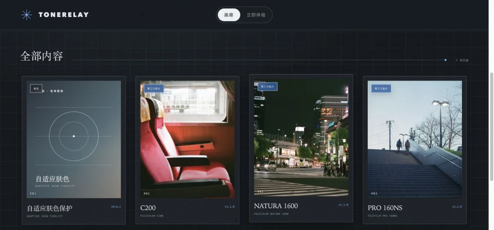
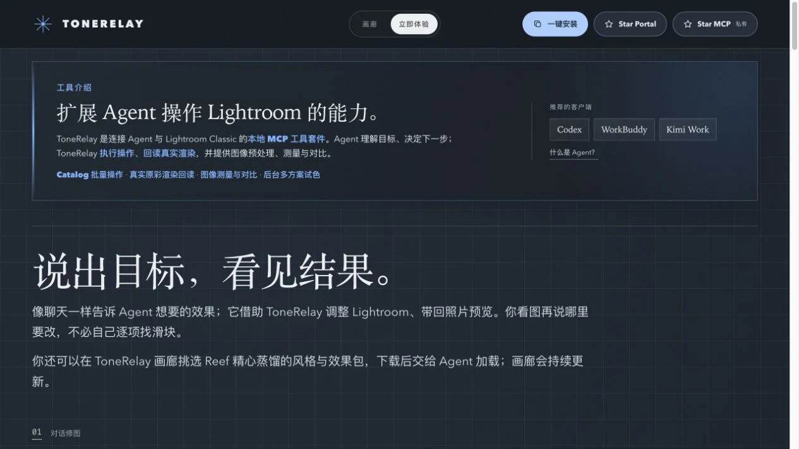

# ToneRelay Portal

Reef 的 Lightroom MCP 风格与效果画廊。浏览参考图、了解风格包，再把想要的效果带进与 Agent 的对话。

[打开网页](https://reefruan.github.io/tonerelay-portal/) · [了解 ToneRelay](https://reefruan.github.io/tonerelay-portal/#experience) · [浏览风格包](style-packs/README.md) · [安装提示词](docs/install-prompt.md) · [常见问题](docs/faq.md)



<sub>画廊截图中的照片：C200 封面 © <a href="https://www.flickr.com/photos/130477966@N06/48806348736">Chipmunk LIN</a>、NATURA 1600 封面 © <a href="https://www.flickr.com/photos/79635710@N05/9758617445">Gemini st.</a>、PRO 160NS 封面 © <a href="https://www.flickr.com/photos/19924293@N08/16203711663/">doca doca</a>，均为 <a href="https://creativecommons.org/licenses/by/2.0/">CC BY 2.0</a>。截图经过缩放；所有参考图的逐图署名与许可见各包 <code>package.json</code>。</sub>

## 这是哪里

ToneRelay 是连接 Agent 与 Lightroom Classic 的本地 MCP 工具套件。Agent 理解修图目标、决定下一步；ToneRelay 执行操作、回读结果，并提供图像预处理、测量与对比。

这个仓库是 ToneRelay 的**网页与公开风格包仓库**，不是 MCP Runtime 本身。网页负责介绍工具、展示和下载风格包、提供安装提示词与答疑；不需要登录或自建后端。

<details>
<summary>查看“立即体验”页面截图</summary>



</details>

## 从这里开始

1. 在[画廊](https://reefruan.github.io/tonerelay-portal/#gallery)挑选风格；点开卡片可查看参考图、风格说明和逐包下载链接。
2. 在[立即体验](https://reefruan.github.io/tonerelay-portal/#experience)了解 Agent、ToneRelay 和对话修图的配合方式。
3. 将[安装提示词](docs/install-prompt.md)交给正在使用的 Agent。提示词会先核实官方公开发行物与固定版本；若尚未就绪，会如实说明，而不会使用私有开发源码。排障时参考 [FAQ](docs/faq.md)。

风格包是供 Agent 阅读的 Markdown 与参考图，不等于 Lightroom 预设，也不代表安装了 MCP。六个公开包的目录、版本及下载入口见 [style-packs/README.md](style-packs/README.md)。

## 仓库内容与本地预览

| 路径 | 内容 |
| --- | --- |
| `src/`、`public/` | 网页源码和轻量预览图 |
| `style-packs/packages/` | 每包独立的 Markdown、封面、参考图与逐图许可 |
| `style-packs/downloads/` | 按包提供的 ZIP |
| `docs/` | 页面介绍、安装提示词、FAQ 与卸载提示词 |

```bash
pnpm install
pnpm dev
```

发布前运行 `pnpm verify:packs && pnpm test && pnpm build`。

## 作者与许可

作者及维护者：[Reef Ruan (@ReefRuan)](https://github.com/ReefRuan)。Copyright (C) 2026 Reef Ruan。

项目作者创作的代码与文字采用 [GNU AGPL-3.0-only](LICENSE)；适用范围和第三方素材例外见 [授权范围](LICENSE-SCOPE.md)。参考照片属于各摄影师，遵循每包 `package.json` 记录的原许可；仓库级 AGPL 不会把这些照片改为项目作者的作品。
