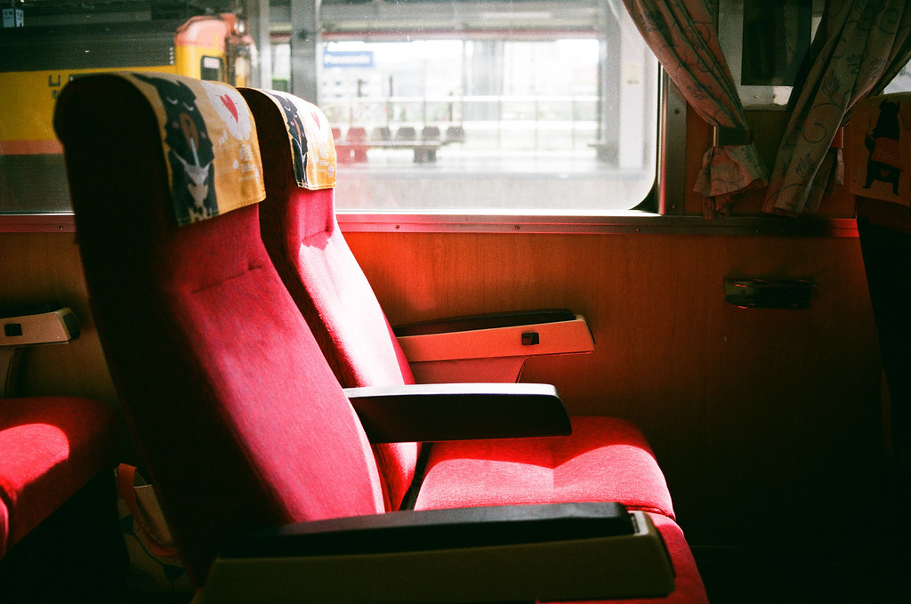
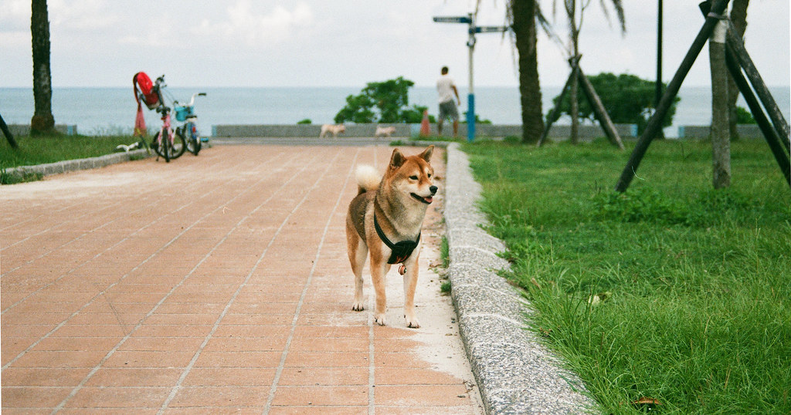
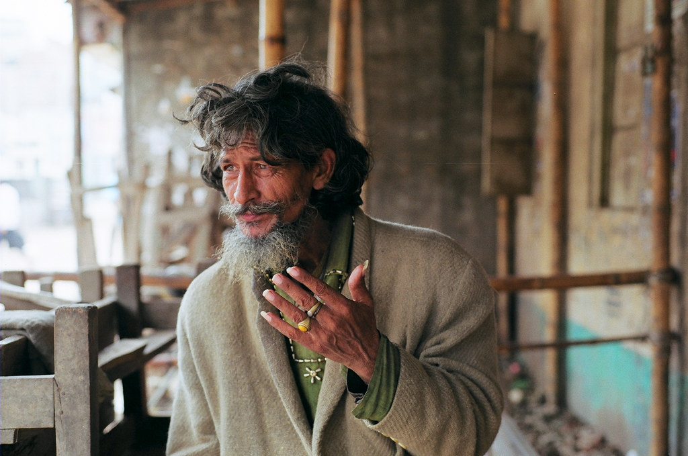
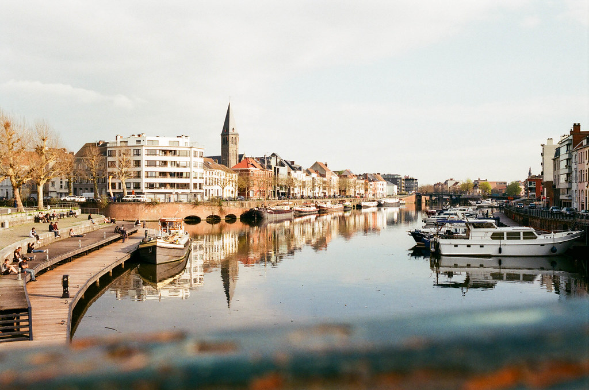
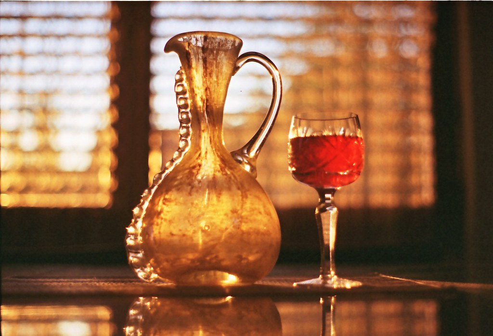
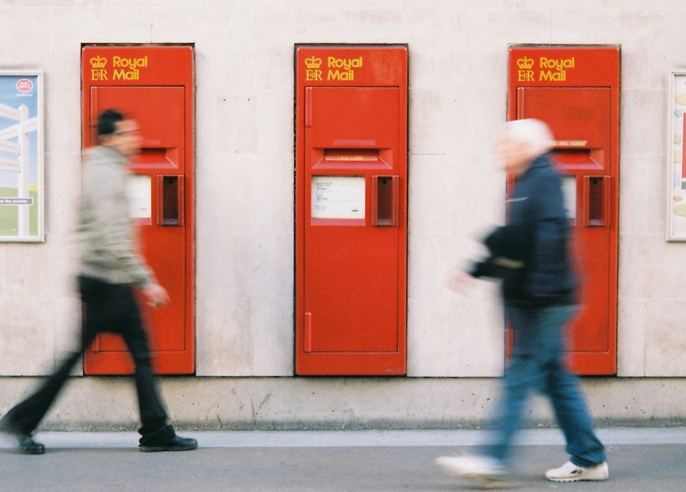
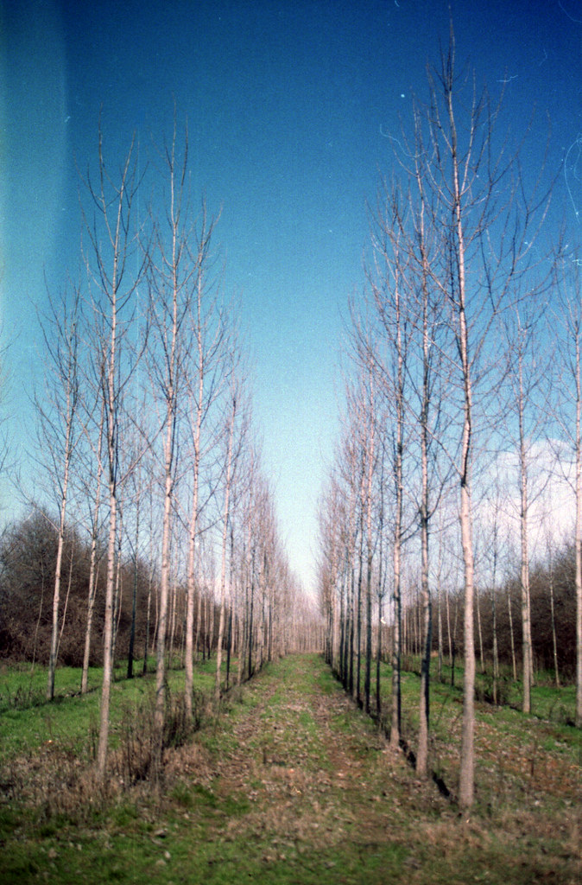
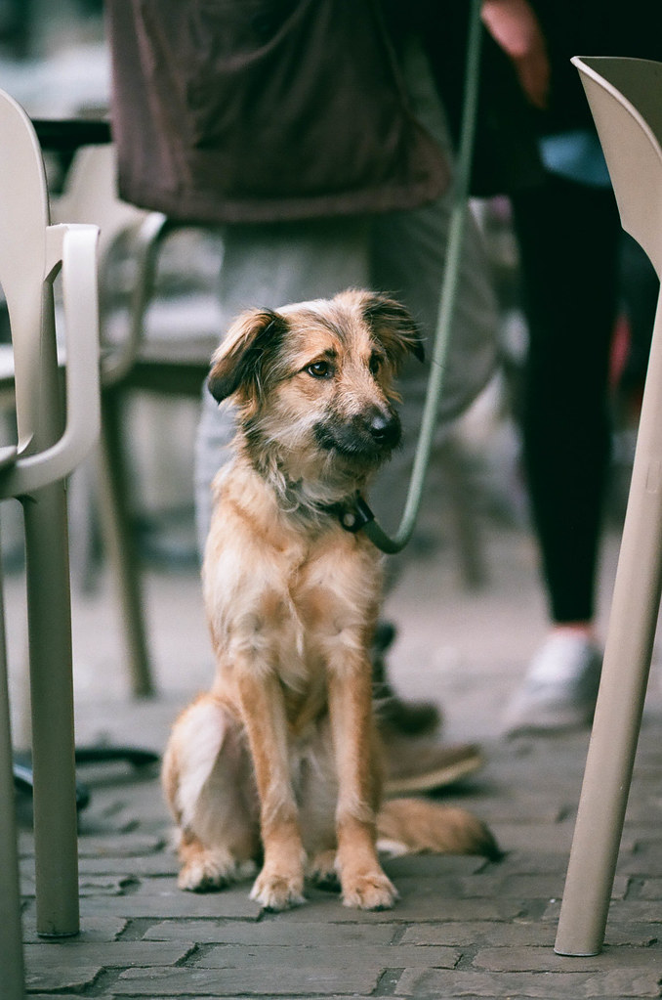
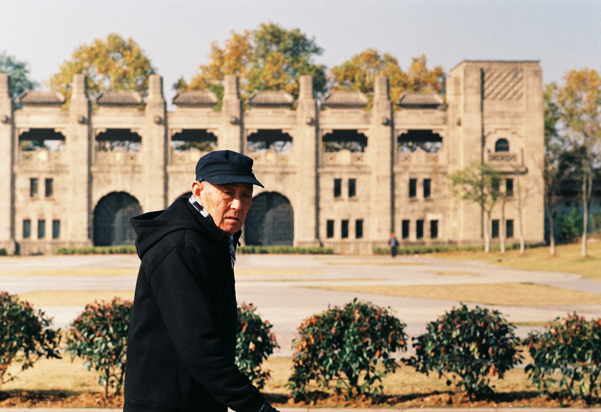
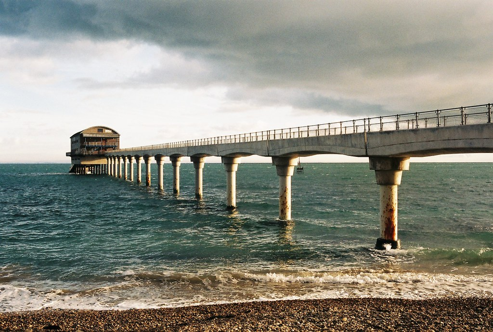

# FUJICOLOR C200

## 风格意图

把 FUJICOLOR C200 理解为一种服务于日常人物、旅行与环境叙事的颜色关系，而不是一个固定的综合色滤镜。优先让真实光线、人物和材料留在画面的中心：肤色、日照下的砂土、木材与红黄物件可以带有可触摸的暖意；天空、阴影、水面和植被则保留各自较冷或较绿的空间层次。整体应亲近、清爽且有生活感，不能被做成统一青绿、褪色棕褐或粉雾覆盖的“怀旧”效果。

## 稳定视觉特征

- 先保留颜色之间的分工，再考虑增加颜色强度。暖色主体与较冷的蓝、青、绿背景能够并存，但任何一侧都不应吞没另一侧。
- 红、橙、黄可以成为视觉锚点，蓝、绿也可以鲜明；优先保留布料、石材、植物和金属上的明暗纹理，而非把颜色推成单一色块。
- 中间调是画面最重要的承载区。人物、砖石、木材、草叶和衣物应保有层次，避免用过强的局部反差或雾化取代真实的材料感。
- 细微、有机的颗粒感可以作为最后的完成感，但它必须低于任何单一网页扫描中可见的颗粒强度；不复制压缩噪点、扫描尘点、暗角或过度锐化。

## 影调结构

先根据主体决定明暗，而不是先套用抬黑或压黑的胶片曲线。高光应有从白色到浅色材料的连续过渡；暗部可以扎实，却要保住主体边缘、衣物褶皱、发丝和环境中的必要信息。中间调应维持明度层级，使暖色物件、肤色和冷色背景仍各有位置。

在硬日光或高反差场景中，优先保护受光皮肤、白衣、砂地、浅墙和亮色衣物，再让阴影保持方向与重量。不要为了开暗部而抹平日照方向，也不要为追求反差而让暗裤、黑发或阴影中的主体失去结构。

在阴天、柔光和开放阴影中，保留较细微的明度顺序即可，不必强行制造硬光式的 S 形反差。允许黑位仍有重心，但不要将所有阴影抬成灰雾。逆光时，先判断主体应是可读的人脸还是有意保留的半剪影；高光与阴影之间应连续，而不是靠全局提亮消除逆光。

## 颜色关系

白平衡必须服从现场，而不是把每张图校成同一种“C200 色温”。以人物皮肤、可信的白灰材料、天空和植被作交叉检查：让暖色主体略向前，让蓝、青、绿退为有空间感的背景，但保留材料本来的冷暖差。

不要把绿色做成固定的“富士绿”。直射光中的绿可以偏亮或偏黄，阴影和树林中的绿可以更深、更中性；重点是前后景之间仍有明度和色相层次。类似地，蓝天不必总是浓青，灰墙不必总是偏冷，木材也不应被一律推橙。

粉红／洋红不是默认特征。只有原图本身已有夕阳、暮色或刻意高调的粉紫关系时，才在天空或相应高光区域谨慎保留；以肤色、白门、浅墙和中性衣物为校验。一旦白色普遍发粉、皮肤失去自然层次，或粉色从局部蔓延进阴影，就应退回。

混合光画面应保留不同光区的关系：冷色外立面、暖色招牌、室内光和综合色物件可以同时存在。不要用一次全局校正把它们压成同一种中性，也不要把人工色本身误当作胶片应附加的饱和度。

## 人像与肤色

先以脸、手和颈部作为调色校验点。柔和的桃色、米色或轻微红润可以成立，但脸部高光、眼周阴影、唇色和手部不能被压成统一橙色或平板粉色。暖光、木材反射和鲜艳衣物存在时，可以让肤色随现场略暖，但要保留肤色与邻近红黄物件的边界。

直射光人像中，先保护额头、鼻梁、颧骨和手部的高光体积；深色裤装、头发和背光侧仍需可读。开放阴影人像中，优先恢复脸与绿色背景之间的局部明度分离，并保住牛仔、发丝和衣物纹理；不要把环境绿直接染到皮肤上。

明亮肖像可以作为一种条件性目标：当原图本身已是刻意的高调人像时，可允许干净、轻暖的皮肤和柔和的高光过渡，但必须保住脸部与浅色背景的差别。这不是对所有输入都应增加曝光的建议，也不是所有肤色的基线。

这组公开参考缺乏受控的跨肤色对照。对不同肤色不推导固定色相或阴影颜色；只沿用“保护局部明度、细节和与背景的边界，避免全局橙化、粉化或灰化”的原则。

## 不同光照、色温与光比

### 硬日光与高光比

保留亮日的清晰方向：浅天空、砂石、白衣和受光皮肤可以明亮，阴影可深，但两端都不能先于主体失去信息。红黄蓝衣物应仍有织物纹理。若画面因强日照显得刺眼，优先柔化最亮区域或局部调整主体，而不是全局加暖、全面提亮阴影。

### 柔光、阴天与开放阴影

让对比随光线放松，保持皮肤、浅墙、衣物和草地之间的微妙次序。若人物被背景吞没，可只增强主体附近的中间调或阴影可读性。停止于白墙普遍发粉、黑衣变成无结构蓝灰、或所有草地被推成同一荧光绿之前。

### 逆光与日落

优先保留由亮到暗的连续关系与太阳方向。低角度光可让道路、草叶、木材或皮肤偏暖；只有当原图支持时，才保留暮色天空的玫瑰或紫色。不要为保高光把天空压成脏灰，也不要为打开阴影而消除剪影和轮廓。

### 混合光

把人物、白色物件和主要商品放回它们各自所在的光区判断。冷暖并置本身可以成立；若暖区变脏黄、冷区变青绿，或空间分区被校成一片单色，说明处理已经越界。

### 低照度、钨丝灯与夜景

这组公开参考不足以建立通用的夜景、钨丝灯或霓虹基线。对低照度原图，只保留可见的层次和必要主体，允许色彩克制；不要凭此套装制造紫绿阴影、高饱和夜景或粗颗粒。夜间人像和室内自然光应让当前原图的现场关系优先，而非从日光样片外推。

## 风光与环境题材

在建筑、街道和旅行场景中，以材料为锚点：砖石、混凝土、金属、木材和灰蓝车体应各自保留温度与纹理。暖色立面配较冷的凹部、深绿色植被配浅色天空，能提供空间而不需要统一的青橙分离。不要把一张偏黄的建筑或偏青的阴影当作全局配方。

风光中的绿色应留出前后景和受光／背光差异；水面、天空与远景可以清爽但不可被染成单一青色。日落时可以保留金暖光与环境的综合色变化，但不要把所有风景都调成金橙或粉紫。

对于本来就有强人工色的店面、旗帜、花朵和衣物，先让色彩服务于场景结构。若蓝、黄、红或粉已经是主体，降低其攻击性并保住周边中性色和细节，比继续提高全局饱和度更接近本套参考的秩序。

## 调色决策顺序

1. 先识别画面的叙事主体与光线条件：人脸、衣物颜色、材料、风景层次或剪影，属于硬日光、柔光、逆光、有限混合光，还是证据不足的条件。
2. 先建立曝光与明暗关系。保护主体高光、保持必要阴影纹理与分离，再决定局部对比需要加强还是放松。
3. 用皮肤、白灰材料、天空和植被交叉检查白平衡；按光区处理冷暖，不以单一综合色覆盖整张图。
4. 再处理红、黄、蓝、绿等显眼颜色。让它们保持相互分离和表面纹理；颜色已经承担主体作用时，优先限制该色，而不是增加整体饱和度。
5. 最后才考虑细微的有机质感。它不能损害脸部、文字、细线、布料或干净的天空，也不能复刻某一张扫描的噪点。
6. 若当前图是夜景、钨丝灯、霓虹、深色皮肤近肖像或受控中性场景，承认证据不足：以原图可信的光线和主体关系为准，保持保守。

## 主体保护与停止信号

始终保护人脸、手部、白色衣物、浅色墙面、黑衣与发丝、红黄蓝衣物的纹理、天空渐变，以及人物与背景的边界。环境图中优先保护砖石、木材、金属、草叶和道路的可读层次。

停止或回退的信号包括：皮肤高光变成粉白而没有体积；白色或浅灰材料被普遍染粉、橙或青；黑衣、深绿和阴影堵成无信息块；为了“胶片感”把所有黑位抬灰；红黄蓝绿先于纹理和光线方向跳出；或一次全局白平衡抹掉混合光的空间分区。

## 公开参考图与使用边界

以下样片由原作者标注为对应胶片拍摄，并按逐张核对过的 CC 许可再分发。不要从任一张样片单独推导固定色温、颗粒、扫描流程或 Lightroom 参数。作者、原图与许可见各图说明及 package.json。

### 01 — 離鄉 / FUJIFILM C200

摄影师：Chipmunk LIN · [原图](https://www.flickr.com/photos/130477966@N06/48806348736) · [CC BY 2.0](https://creativecommons.org/licenses/by/2.0/)。这是一张具体曝光与扫描条件下的实拍参考，不是该胶片的统一色彩标准。

### 02 — 公園的小柴柴 / FUJIFILM C200

摄影师：Chipmunk LIN · [原图](https://www.flickr.com/photos/130477966@N06/48805907483) · [CC BY 2.0](https://creativecommons.org/licenses/by/2.0/)。这是一张具体曝光与扫描条件下的实拍参考，不是该胶片的统一色彩标准。

### 03 — ...

摄影师：Sudipta Arka Das · [原图](https://www.flickr.com/photos/34804966@N03/8044297521) · [CC BY-SA 2.0](https://creativecommons.org/licenses/by-sa/2.0/)。这是一张具体曝光与扫描条件下的实拍参考，不是该胶片的统一色彩标准。

### 04 — Edit -1-5

摄影师：Dane Van · [原图](https://www.flickr.com/photos/11028609@N05/40348704133) · [CC BY 2.0](https://creativecommons.org/licenses/by/2.0/)。这是一张具体曝光与扫描条件下的实拍参考，不是该胶片的统一色彩标准。

### 05 — Jug and Glass

摄影师：Toffee Maky · [原图](https://www.flickr.com/photos/86543134@N03/13442559963) · [CC BY-SA 2.0](https://creativecommons.org/licenses/by-sa/2.0/)。这是一张具体曝光与扫描条件下的实拍参考，不是该胶片的统一色彩标准。

### 06 — Postbox Trio

摄影师：Chi Bellami · [原图](https://www.flickr.com/photos/46644449@N02/8128629297) · [CC BY-SA 2.0](https://creativecommons.org/licenses/by-sa/2.0/)。这是一张具体曝光与扫描条件下的实拍参考，不是该胶片的统一色彩标准。

### 07 — Planned Nature

摄影师：brenkee · [原图](https://www.flickr.com/photos/55128416@N05/13088517763) · [CC0 1.0](https://creativecommons.org/publicdomain/zero/1.0/)。这是一张具体曝光与扫描条件下的实拍参考，不是该胶片的统一色彩标准。

### 08 — Edit -1-9

摄影师：Dane Van · [原图](https://www.flickr.com/photos/11028609@N05/39899830840) · [CC BY 2.0](https://creativecommons.org/licenses/by/2.0/)。这是一张具体曝光与扫描条件下的实拍参考，不是该胶片的统一色彩标准。

### 09 — 中央体育场 | 南京

摄影师：+AARON++ · [原图](https://www.flickr.com/photos/50704193@N07/8284339196) · [CC BY-SA 2.0](https://creativecommons.org/licenses/by-sa/2.0/)。这是一张具体曝光与扫描条件下的实拍参考，不是该胶片的统一色彩标准。

### 10 — RNLI Bembridge Lifeboat Station, Isle of Wight

摄影师：Chi Bellami · [原图](https://www.flickr.com/photos/46644449@N02/46786107765) · [CC BY-SA 2.0](https://creativecommons.org/licenses/by-sa/2.0/)。这是一张具体曝光与扫描条件下的实拍参考，不是该胶片的统一色彩标准。
