# FUJICOLOR NATURA 1600

## 风格意图

把 FUJICOLOR NATURA 1600 用作高感纪实关系，而不是一套固定的夜景滤镜。它的目标是在可用光有限、色温混杂或明暗跨度很大时，让人、食物、招牌、湿路、建筑或风景中的关键关系仍能被读到：环境可以暗，实用灯和局部颜色可以强，主体与空间却不应被压扁、磨平或统一染色。

优先让现场光继续解释画面。暖灯、红橙黄物体、冷青或绿色环境、淡日光天空和阴天中性色可以在同一套风格中共存，但必须由当前画面的光源、物体和反差决定。不要把城市夜景、湿路、霓虹、亚洲市场或长曝光本身误作此风格的必要内容。

## 稳定视觉特征

- 以局部色彩关系而非全局色偏建立记忆点。暖实用灯、红橙黄物体常可比相邻中性色更有存在感；冷青、蓝或绿则保留在确有相应光源、反射或对象的区域。
- 主体从暗环境中读出，主要依赖中间调、受光面、局部色和明暗层级，不依赖把全部阴影抬成灰或把轮廓锐化得像数码切割。
- 高反差场景可拥有真实的近黑区域和少量接近无细节的高光；柔阴和阴天场景则更安静、反差更低，但脸、衣物和背景之间仍应有细微的层次。
- 细节的观看感偏向连续、有机而非过度锐利。高感纹理可以在阴影、纯色面或低照度中可见，但它不是均匀覆盖的数字噪点，也不是失焦、运动模糊或强暗角。

## 影调结构

先判断当前图像属于高反差还是低反差场景，再决定黑位和中间调的关系；不存在可套用到全部照片的固定曲线。

- 在夜景、点光、钨丝店面、霓虹、雨夜或硬日光中，允许门洞、夜空、黑衣或画面边缘保有深密度。只在能帮助识别主体、保持空间方向或保护关键纹理的地方保留暗部信息；不要为了“通透”把整张图拉成无方向的灰。
- 在阴天、柔阴或低光比人物中，降低明暗斜率，优先保留面部转折、深色衣物、浅色衣料和相邻背景的微小差异。低反差不等于雾化，也不等于把皮肤去成灰粉。
- 高光先按重要性处理。保护贴近主体的脸、浅色衣物、彩色招牌、食物或建筑轮廓；允许无关的天空、灯泡、灯箱和镜面反射接近白亮，并保留自然的软过渡。不要为了找回每个高光而把整幅画面压成脏灰。
- 如需保留高感质感，优先保留现有的细微颗粒与连续过渡；避免重度降噪后的蜡感，也避免用人工模糊或颗粒掩盖原图的细节问题。

## 颜色关系

- 不设定统一的暖白、青白或褪色基线。中性色应服从当前光线：阴天可偏冷灰，日光可呈浅暖或淡蓝，荧光可带冷青或绿感，钨丝可保留暖黄与琥珀。
- 红、橙、黄与暖实用灯应保有色相之间的区别和表面纹理，而不是被推成一片没有层次的高饱和块。若这些颜色已是画面的锚点，优先保护它们与相邻暗部、肤色或中性色的分离。
- 蓝、青和绿只在光源、雨面、水面、天空、荧光环境或对象支持时保留。日光植被可深、略冷或略橄榄，但不应被强制改成荧光绿；日光天空可以轻、淡、有空气感，不应被强制染成夜景青蓝。
- 多光源画面使用局部判断：让暖灯、冷灯、反射和物体本色各自成立。只有在画面中找不到光源或物体依据时，才把统一的异常色偏视为应限制的扫描或显示倾向。

## 人像与肤色

人物优先于全局气氛，但不应被校成脱离现场的同一肤色。先确认脸部的主光、阴影、环境反射和与背景的明度关系，再决定如何限制过强色偏。

- 阴天、柔阴和相对中性的日光下，保持克制的暖中性、轻微红润或环境冷暖，同时保留眼周、嘴唇、发际线、皱纹和衣物的真实细节。不要单独增加红橙来制造“健康感”，也不要以褪色代替柔和。
- 钨丝与暖实用灯下，允许受光面带暖色；保护脸部、浅色衣物和食物中的层次，避免把阴影、白衬衫和整张脸一起推成橘黄。
- 霓虹和混合人工光下，允许青、品红、暖黄或白色实用灯影响脸部邻近区域。重点是面部仍可读、不同肤色明度仍有区分、脸与背景不黏连；不要把整张脸染成青色、品红色或单一橙色。
- 荧光市场或冷混合室内光下，保留冷青环境、白色台面或鱼货的条件性色彩，同时维持可读的面部。不要用钨丝夜景的暖肤模板去覆盖这类场景，也不要让脸随环境变成无生气的灰绿。
- 硬日光人物保留受光面、深色衣物与阴影空间的方向。当前证据不支持把它外推成均匀日光商业肖像的固定肤色标准，因此应以当前脸部可读性和光源可信度为停止点。

## 不同光照、色温与光比

| 当前条件 | 先判断 | 调色方向与保护对象 | 停止信号 |
|---|---|---|---|
| 柔阴、阴天、低光比人物 | 面部与背景之间是否仍有细小明度和色相差异 | 降低整体冲突，保留柔和中间调、深色衣物、自然肤色和小面积红绿物 | 皮肤发灰、暗衣变成雾灰，或靠局部清晰度制造硬边 |
| 硬日光、高反差街景 | 哪些亮面和阴影定义了空间，脸部是否处于受光或阴影 | 保留日晒墙面、浅天空或金属反光的亮度；保留深通道、黑衣和主体边缘的方向 | 为救天空使所有高光变灰，或为救阴影把画面变成无方向的 HDR |
| 钨丝、暖店面、食摊 | 暖色来自哪盏灯，哪些白色或皮肤与它相邻 | 保持暖黄、琥珀、红橙的局部密度，保护浅色食物、灯笼和人脸亮面 | 整图被校成灰白商店灯，或所有肤色、阴影和白物一起发橙 |
| 荧光或复杂室内混合光 | 冷青、绿、黄白和肤色分别由什么光源或对象产生 | 先保留关键人物和近中性物体，再允许环境色分区存在 | 为追求“干净”而中和全部环境，或让人脸被青绿吞没 |
| 霓虹、雨夜、低照度街景 | 哪些点光、反射、面部或衣物承担阅读顺序 | 保留深暗底色、有限而有色相的高光、湿面反射和人物可读的受光面 | 所有阴影同样褪灰，所有灯牌变成空白白块，或人脸被彩色光完全覆盖 |
| 明确逆光或窗光 | 本套没有足够的直接对照；先判断主体能否从亮背景中读出 | 仅沿用通用顺序：保护主体邻近亮部、人物轮廓和真实背景亮度，不虚构专门的逆光色偏 | 皮肤沦为灰剪影、发丝被人为描白，或亮背景被压成脏灰 |
| 长曝光星空、极端低照度风光 | 是否确有长曝光、月光、倒易率或类似技术条件 | 可让深蓝青天空、暖地景和明显低照度纹理作为特殊场景关系 | 把暗角、粗颗粒、色移、星轨或长曝软化移植到普通手持照片 |

## 风光与环境题材

环境题材应像人物所在的真实空间，而不是为了“胶片感”而替换成某种地点或天气。街道、市场、店面、雨面、砖石、水面和自然植被都可通过深浅关系与局部色建立层次。

- 日间风光和建筑保留空气感：淡天空、受光建筑、红黄物件和深色结构不必被同一综合色统治。
- 阴天、晨昏和自然环境中，允许粉灰天空、深绿或略橄榄植被、暖暗地面在合理光线下并存；保护远近景的明暗与色温差，而不是用大幅清晰度制造距离。
- 夜间环境可让点光、窗内、湿地反射或吧台从深暗中出现。深暗应服务于空间与观看重点，不应成为压死一切细节的黑位模板。
- 不要新增湿路、霓虹、城市招牌、强暗角或过度颗粒来追随参考场景；这些均是题材或过程条件，而不是素材不足时的补偿效果。

## 调色决策顺序

1. 识别主体、主光源、次光源、场景反差以及最重要的高光。先确定这是柔阴、硬日光、钨丝、荧光、霓虹、混合光还是证据不足的条件。
2. 建立曝光层级：让人物、关键物体或空间锚点先可读；允许低优先级天空、点光或反射保持亮度，也允许不服务主体的暗区保持深度。
3. 保留现场色的分工。先保护红黄暖物、肤色、冷青环境、绿色或中性物之间已存在的关系；只限制没有光源或物体依据的全局偏色。
4. 单独检查人物。比较受光面、阴影、环境反射、眼周和衣物，确保脸部没有被全局色、过度降噪或过度锐化牺牲。
5. 调整中间调与细节的观看感。优先连续过渡、可读纹理和适中的局部层次；避免把高感气氛做成均匀噪点、人工柔焦或过锐边缘。
6. 在正常观看尺度复核整个画面：它应看起来像同一场景里的光和颜色彼此协调，而不是套上统一青橙、暖褐、褪色或 HDR 滤镜。

## 主体保护与停止信号

| 主体或要素 | 优先保护 | 不应以何种方式换取风格 |
|---|---|---|
| 人物与肤色 | 面部可读性、受光方向、眼周与嘴唇细节、脸与背景的分离 | 统一暖肤、灰绿肤、霓虹全染、磨皮或锐化描边 |
| 暖灯、红橙黄物体与食物 | 局部色相分离、亮部纹理、与暗部或中性色的关系 | 全图增饱和、红橙剪裁成平面、把白物一起染暖 |
| 冷灯、天空、水面与绿色 | 与真实光源或对象相符的冷暖、远近层次和细节 | 把所有蓝绿处理成统一青色或荧光绿 |
| 高光与反射 | 主体邻近高光、关键招牌色、浅色衣物和空间方向 | 为回收每个高光而压灰整图，或把有色实用灯洗成白块 |
| 深暗与纹理 | 黑衣、门洞、夜空和背景中的必要形状；已有的自然高感纹理 | 抬灰全部阴影、压死主体附近细节、添加均匀噪点、暗角或假失焦 |

停止于以下任一情况：全场人工光被中和；白天、荧光和夜景变成同一综合色；皮肤替全局风格承担过多橙、青、绿或品红；高光和阴影同时失去方向；红黄或霓虹颜色变成无纹理色块；或降噪、颗粒、模糊和锐化开始比画面主体更显眼。

## 公开参考图与使用边界

以下样片由原作者标注为对应胶片拍摄，并按逐张核对过的 CC 许可再分发。不要从任一张样片单独推导固定色温、颗粒、扫描流程或 Lightroom 参数。作者、原图与许可见各图说明及 package.json。

### 01 — nightwalk

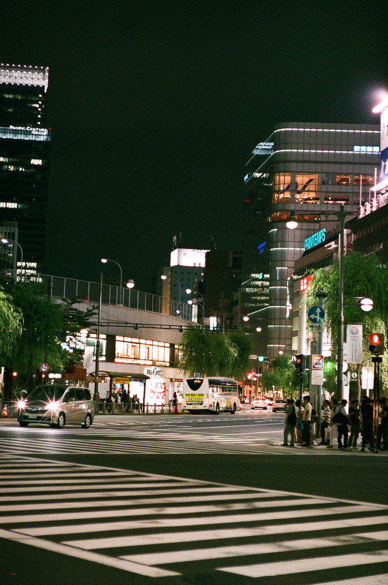

摄影师：Gemini st. · [原图](https://www.flickr.com/photos/79635710@N05/9758617445) · [CC BY 2.0](https://creativecommons.org/licenses/by/2.0/)。这是一张具体曝光与扫描条件下的实拍参考，不是该胶片的统一色彩标准。

### 02 — Light from Window

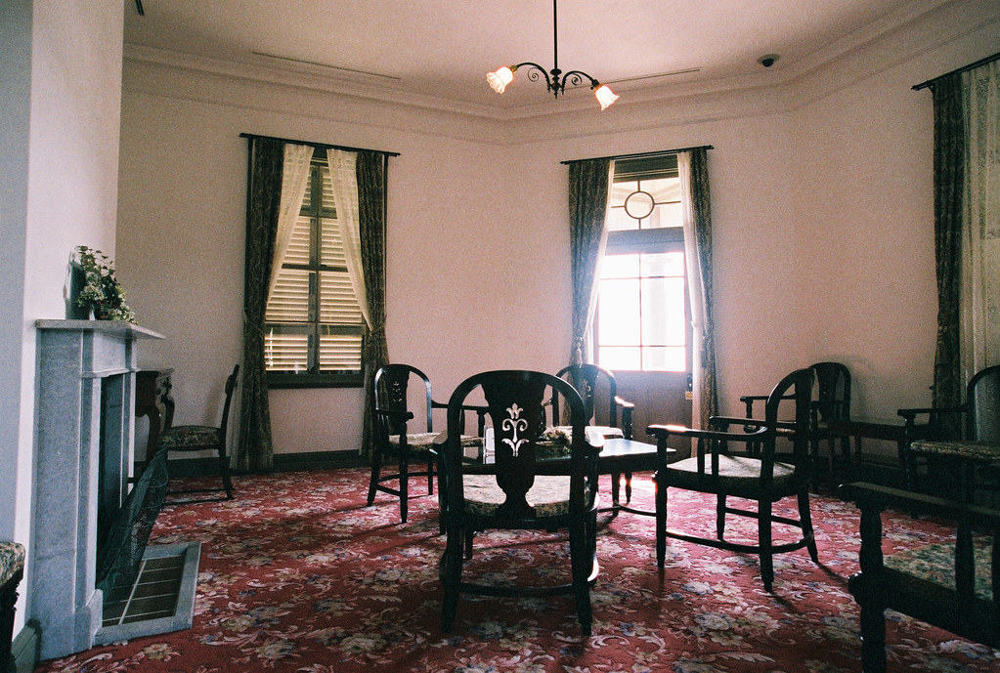

摄影师：halfrain · [原图](https://www.flickr.com/photos/54217251@N05/14515642661) · [CC BY-SA 2.0](https://creativecommons.org/licenses/by-sa/2.0/)。这是一张具体曝光与扫描条件下的实拍参考，不是该胶片的统一色彩标准。

### 03 — From the First Floor

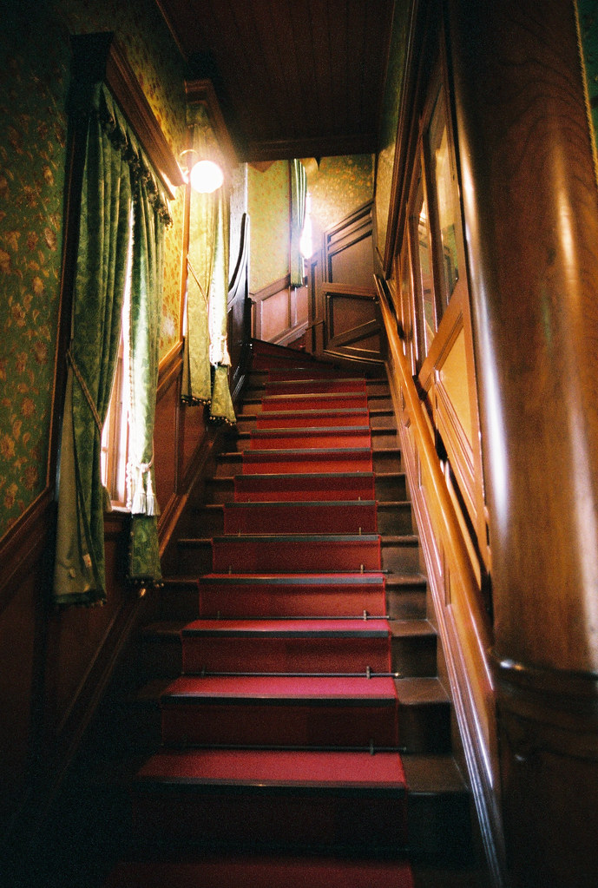

摄影师：halfrain · [原图](https://www.flickr.com/photos/54217251@N05/15109435924) · [CC BY-SA 2.0](https://creativecommons.org/licenses/by-sa/2.0/)。这是一张具体曝光与扫描条件下的实拍参考，不是该胶片的统一色彩标准。

### 04 — 静 (Sei)

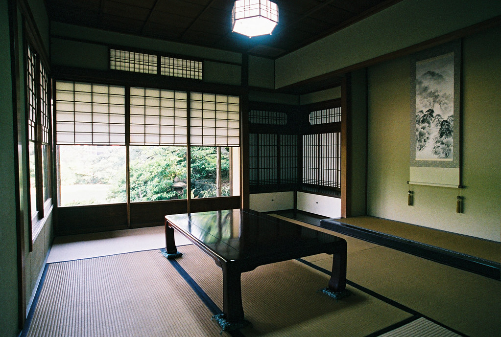

摄影师：halfrain · [原图](https://www.flickr.com/photos/54217251@N05/16625241987) · [CC BY-SA 2.0](https://creativecommons.org/licenses/by-sa/2.0/)。这是一张具体曝光与扫描条件下的实拍参考，不是该胶片的统一色彩标准。

### 05 — Hiroshima #6

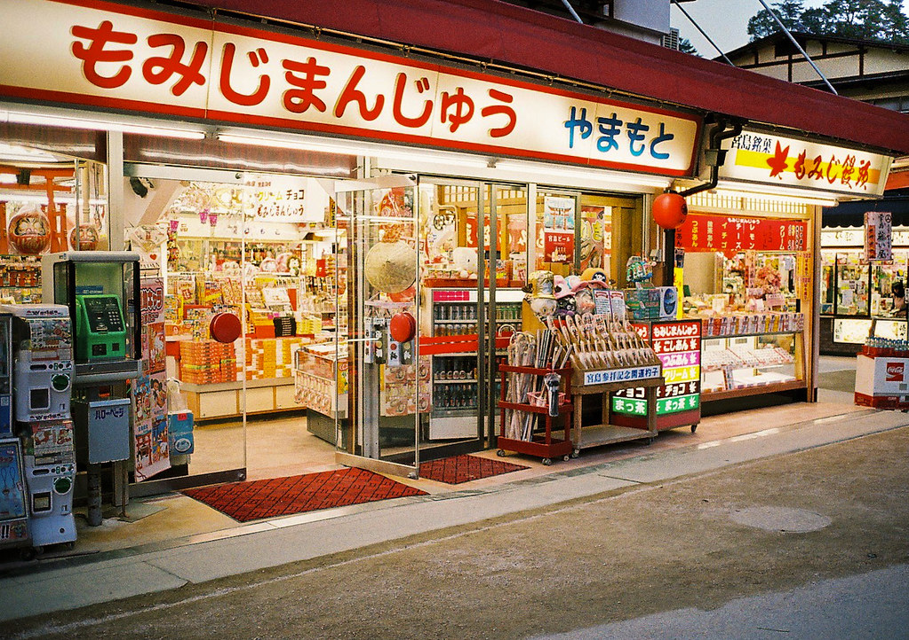

摄影师：Guwashi999 · [原图](https://www.flickr.com/photos/16877319@N07/7227526982) · [CC BY 2.0](https://creativecommons.org/licenses/by/2.0/)。这是一张具体曝光与扫描条件下的实拍参考，不是该胶片的统一色彩标准。

### 06 — Jena (2)

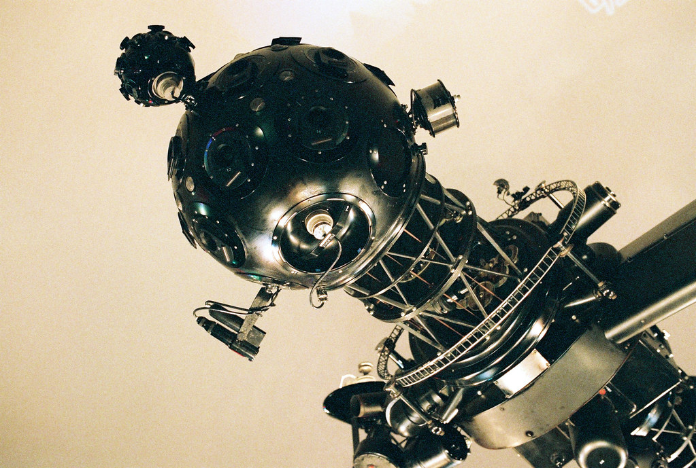

摄影师：halfrain · [原图](https://www.flickr.com/photos/54217251@N05/14402622496) · [CC BY-SA 2.0](https://creativecommons.org/licenses/by-sa/2.0/)。这是一张具体曝光与扫描条件下的实拍参考，不是该胶片的统一色彩标准。

### 07 — The Machine

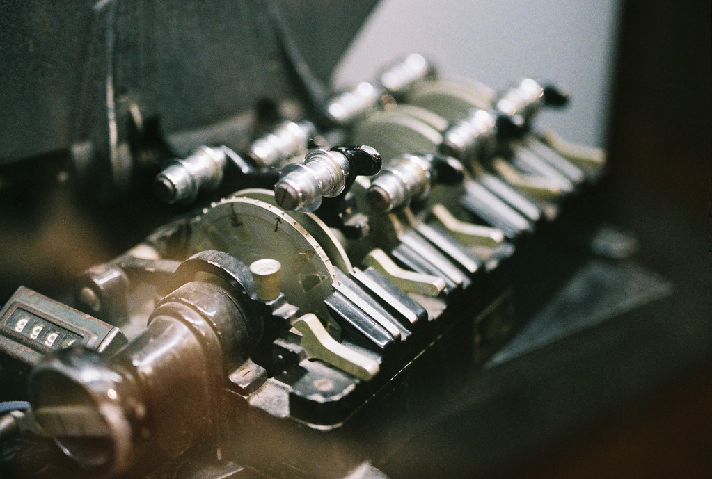

摄影师：halfrain · [原图](https://www.flickr.com/photos/54217251@N05/14818814190) · [CC BY-SA 2.0](https://creativecommons.org/licenses/by-sa/2.0/)。这是一张具体曝光与扫描条件下的实拍参考，不是该胶片的统一色彩标准。

### 08 — Hiroshima #8

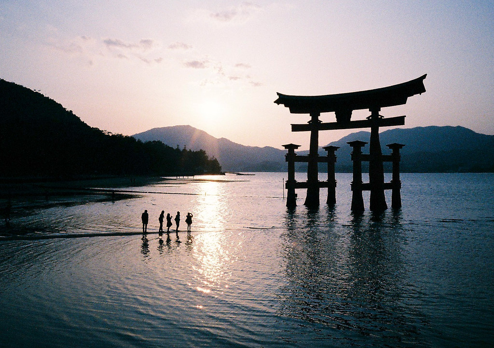

摄影师：Guwashi999 · [原图](https://www.flickr.com/photos/16877319@N07/7241912330) · [CC BY 2.0](https://creativecommons.org/licenses/by/2.0/)。这是一张具体曝光与扫描条件下的实拍参考，不是该胶片的统一色彩标准。

### 09 — From the Second Floor

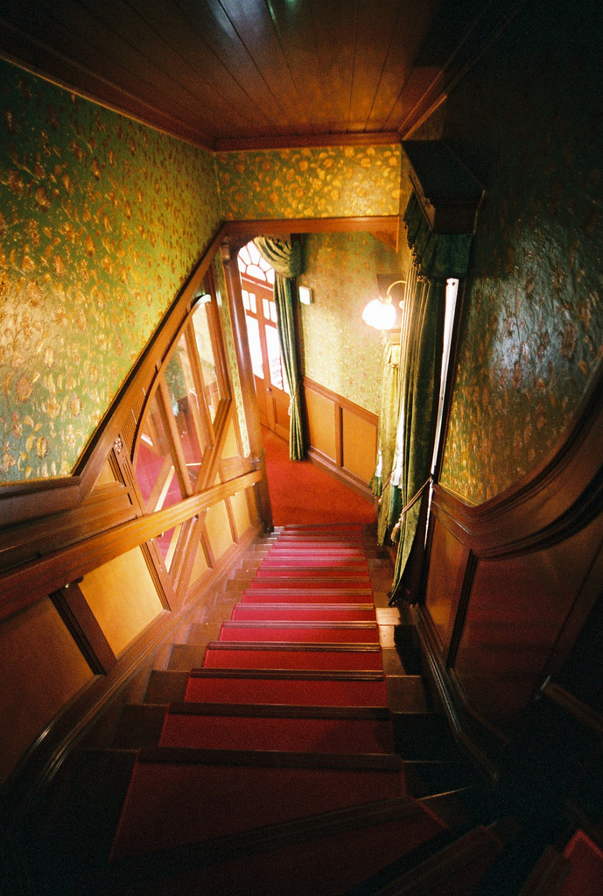

摄影师：halfrain · [原图](https://www.flickr.com/photos/54217251@N05/15546166020) · [CC BY-SA 2.0](https://creativecommons.org/licenses/by-sa/2.0/)。这是一张具体曝光与扫描条件下的实拍参考，不是该胶片的统一色彩标准。

### 10 — twinkle lights & lives /Showa Kinen Park

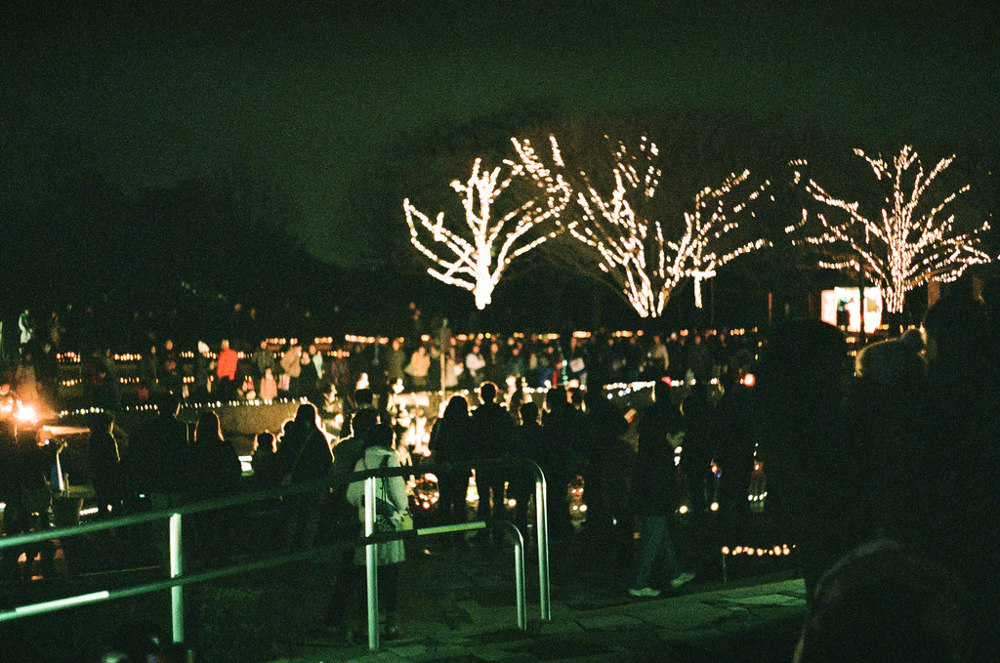

摄影师：Gemini st. · [原图](https://www.flickr.com/photos/79635710@N05/11946449764) · [CC BY 2.0](https://creativecommons.org/licenses/by/2.0/)。这是一张具体曝光与扫描条件下的实拍参考，不是该胶片的统一色彩标准。

### 11 — twinkle lights & lives /Showa Kinen Park

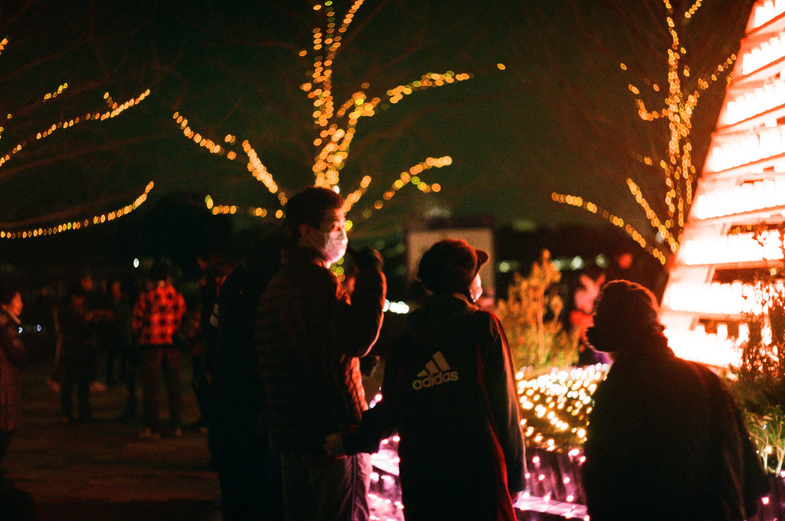

摄影师：Gemini st. · [原图](https://www.flickr.com/photos/79635710@N05/11946320514) · [CC BY 2.0](https://creativecommons.org/licenses/by/2.0/)。这是一张具体曝光与扫描条件下的实拍参考，不是该胶片的统一色彩标准。

### 12 — nightwalk

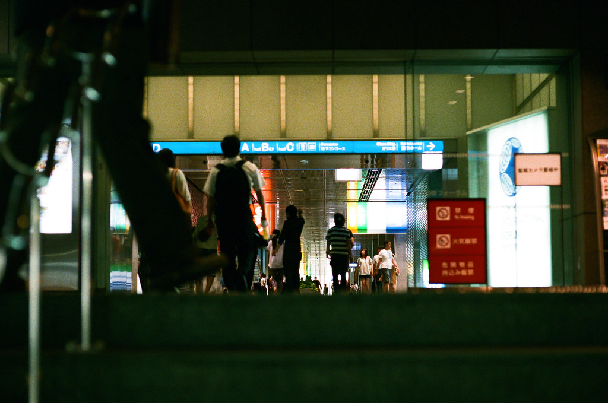

摄影师：Gemini st. · [原图](https://www.flickr.com/photos/79635710@N05/9758715595) · [CC BY 2.0](https://creativecommons.org/licenses/by/2.0/)。这是一张具体曝光与扫描条件下的实拍参考，不是该胶片的统一色彩标准。
