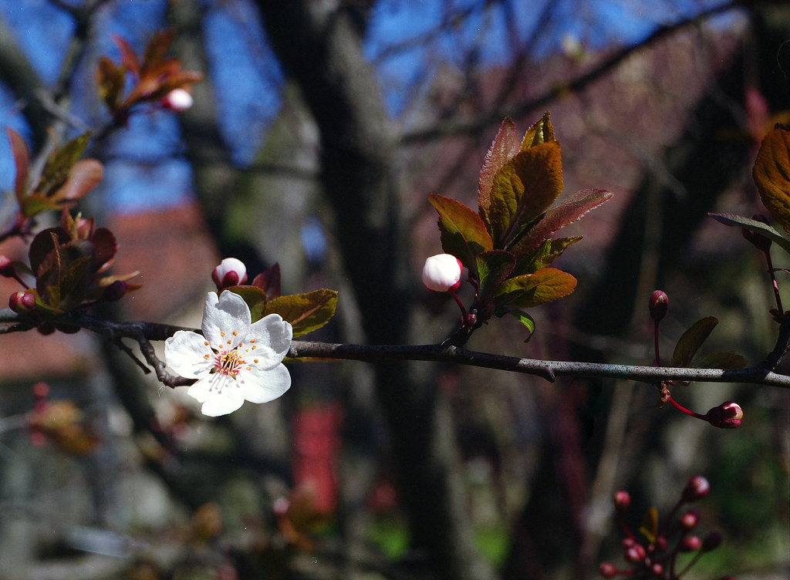
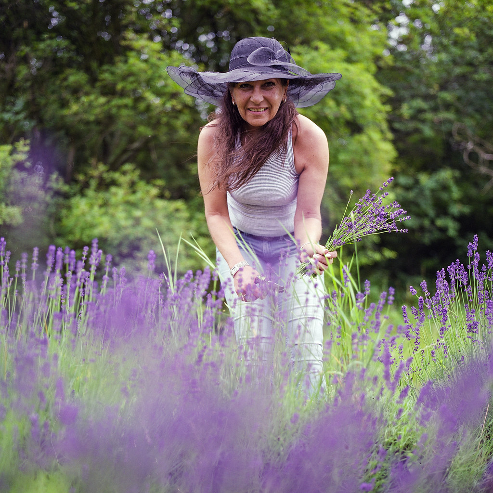
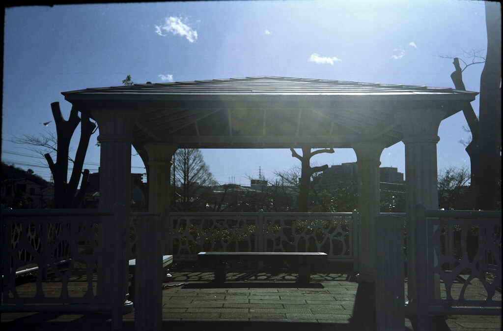
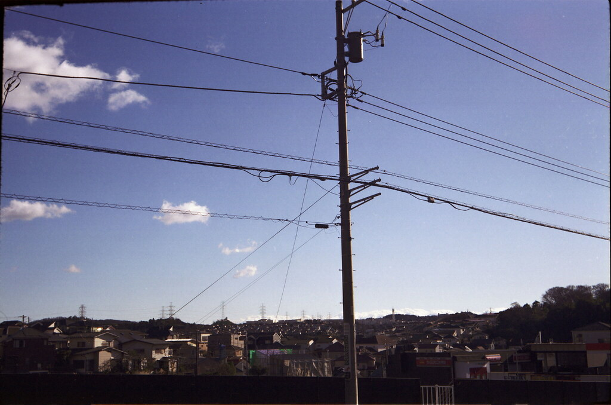
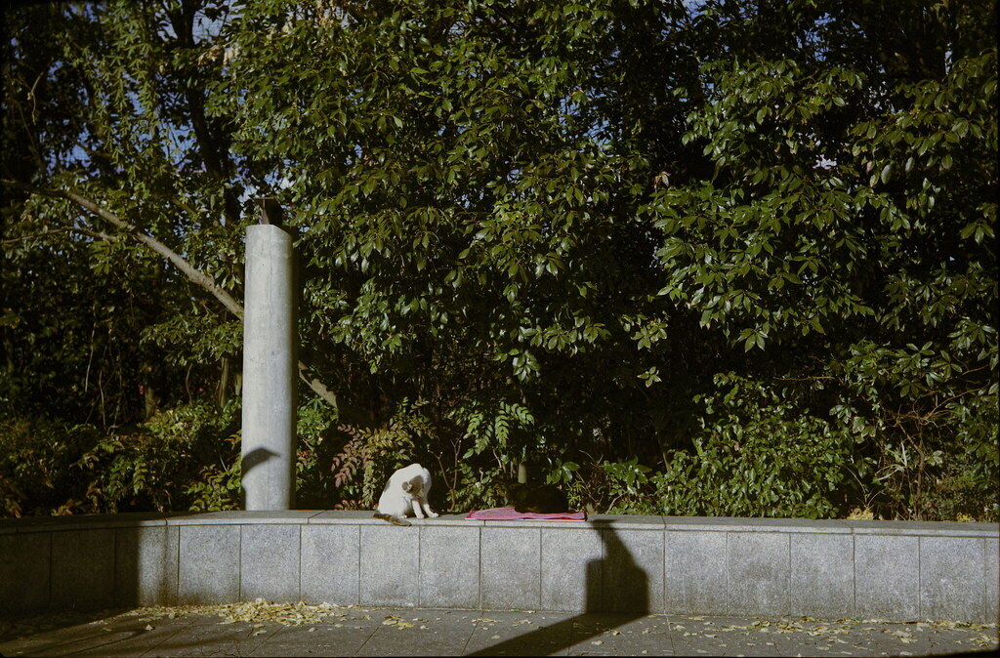
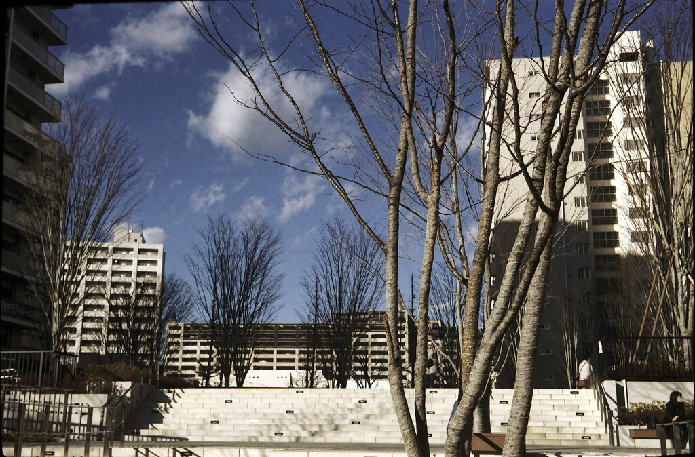
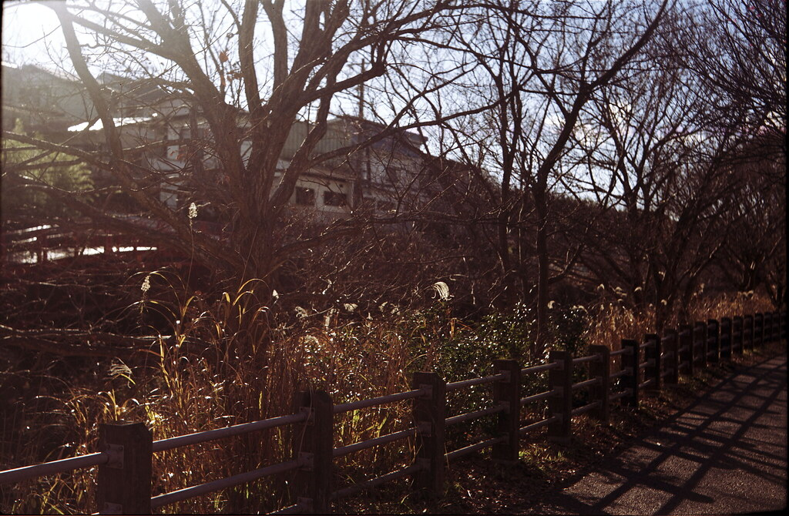
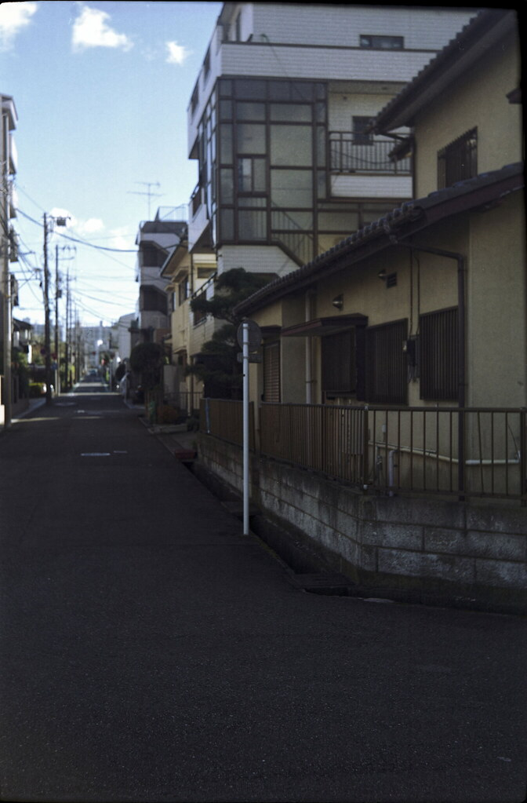
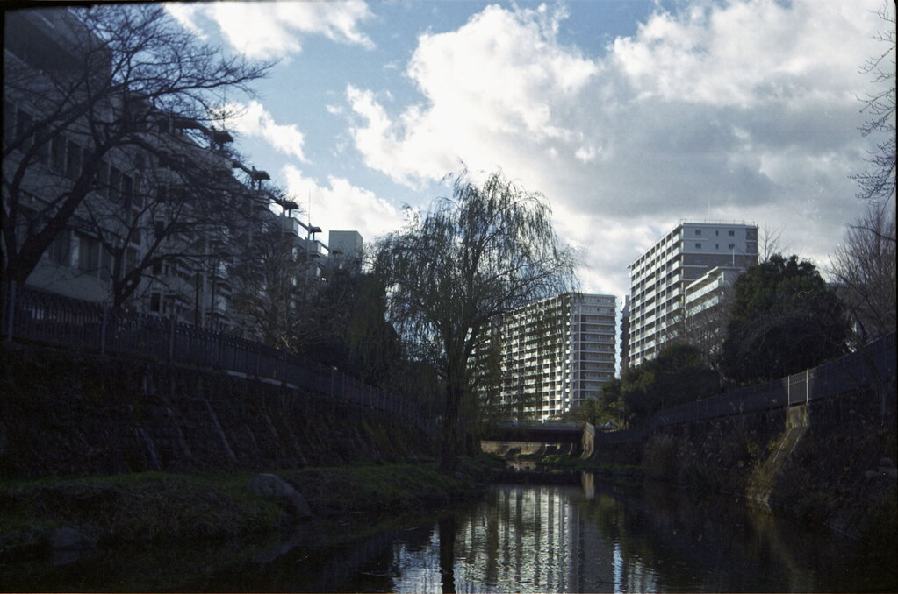
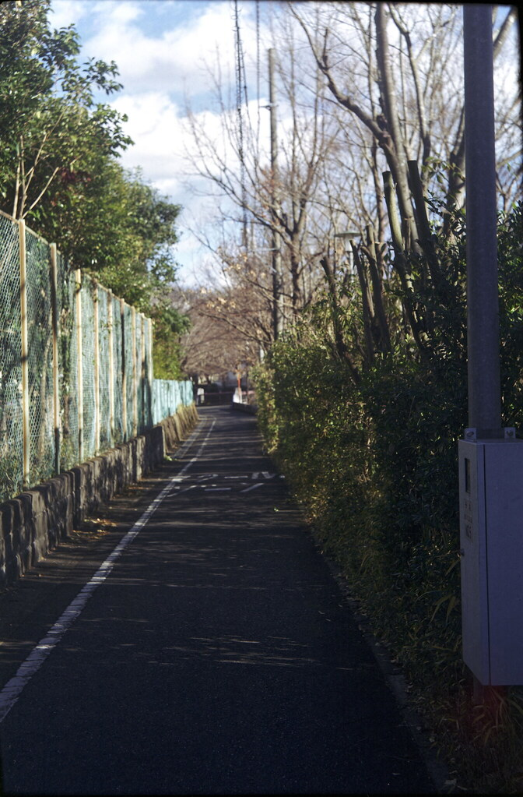

# FUJIFILM PRO 160NS

## 风格意图

把这支片理解为一套以主体可读性、亮部余量和场景内颜色关系为先的彩色负片意图，而不是一条固定的“粉彩”或“青橙”预设。柔和的人像可以明亮、轻盈而有亲近感；日照强烈、反差很大的车与建筑，也可以保留深黑、浓蓝、砖红和明确的方向性。共同目标是让肤色、白色材料、深色物体与环境色各有位置，而不把整幅画面压进同一种滤镜色调。

## 稳定视觉特征

- 主体色通常比周围的低彩背景更有存在感：珊瑚、洋红、芥末黄、棕色车漆、砖红或暖灯可成立，但不需要让所有颜色一起增艳。
- 画面允许明与暗同时扎实存在。柔光中是连贯、轻的高调；硬光中则允许暗部成为稳定锚点，不把深色一律抬灰。
- 冷暖关系多为场景内的分工，而非全局染色：蓝天、水面、玻璃或深蓝车漆可以同暖棕、砖红、肤色、花朵或灯光并置。
- 纹理服务于材质和主体，而不是作为复古标志。不要从网页压缩、扫描颗粒、灰尘或失焦中抽取统一的“胶片颗粒”。

## 影调结构

- 在阴天海边、开阔阴影或柔和人像中，先维持高值区域的层次：浅灰、乳白、沙地和天空应仍有微小色别与质地；脸部不能因追求高调而变成无血色的白面。
- 在直射日光、侧光、逆光和黑色/深蓝物体中，允许阴影沉下去以固定画面，但要保住黑衣、车漆、头发、树荫或室内阴影中的层次线索。不要用统一的提黑来把硬光改成奶油感。
- 高光应先看白衣、反光金属、混凝土、雪和灯点是否保留材质，再决定压制程度。柔化高光可以是局部结果，不能以大面积灰雾替代。
- 不强行给每幅图同一条 S 曲线：低反差场景需要的是连续过渡；高反差场景需要的是亮、暗、主体之间仍可辨的秩序。

## 颜色关系

- 以可信的中性色为起点。白衣、浅混凝土、沙地、窗框、雪和灰色路面应随其所受光线略暖或略冷，而非被统一校成纯白、统一黄或统一青。
- 肤色和暖色小面积物体要比背景更易读，但饱和度不应替代明度和质感。珊瑚或洋红服装可以浓于皮肤，皮肤仍须保留较柔和的桃、玫瑰、蜂蜜或自然褐色层次。
- 对蓝色采用保护而非染色：天空、深蓝车漆、水面和玻璃可有不同明度与密度；不要为了“胶片蓝”把阴影和中性色一并推青。
- 绿色需要让位给受光和空间。绿叶在柔荫中可深、可偏冷；在日照中可更鲜明，但不要把它们统一做成荧光绿或用全局洋红去压绿。
- 砖红、锈红、棕色和暖黄应与冷蓝并存，而不是被拉成同一暖棕。若红色开始吞掉材质细节，先局部收束红橙，再检查白平衡，不以整体降饱和解决。

## 人像与肤色

- 现有可直接观察的人像以偏浅肤色为主。柔光下，脸部可呈温和的桃金或浅玫瑰，眼周、发际、鼻翼和颈部仍要保留自然的冷暖与阴影；不追求塑料般无阴影的肤面。
- 强日光和车内混光中，先让脸、手和白衣各自符合所在光线，再处理周边蓝车、绿篱和混凝土。不要用一个全局色温把阴影脸和日照背景同时“修正”。
- 妆容、服装颜色与创作造型会显著影响可见肤色。当前证据不足以为更深或更多样的肤色建立色相、明度或饱和度规则；实际调色应以该张人像的真实皮肤和受光为准。

## 不同光照、色温与光比

- 柔光、阴天和高调环境：以脸和浅色材料为曝光基准，保住乳白背景与水面/沙地的微差；让冷灰蓝背景后退，避免把明亮误做成低饱和或过曝。
- 绿荫与开放阴影：先确定肤色或明确中性物是否被叶面反射污染，再做局部校正；可以保留背景绿的深度，不要为了去绿而向全画面加洋红。
- 直射日光与强光比：先看白衣、浅路面、金属反光和脸部高光，再让深车漆、黑衣、树荫或建筑阴影成为有层次的暗锚。不要因担心“对比太大”而消除太阳光方向。
- 逆光和耀斑：允许局部亮边或轻微光晕存在，但应先保护主体轮廓、车身/头发的暗部信息。不要人为添加雾化、漏光或耀斑来模仿某一张样片。
- 车内外混合日光：把车厢阴影、窗外天空、车漆反射和皮肤视为不同空间，必要时用局部白平衡和局部明度分离；单一全局色温通常会牺牲其中一方。
- 夜景：可维持暖灯、冷白灯、积雪/石材和深蓝黑天空的分离，但这组公开样片不足以建立夜景的通用基线。不能从日光样片推导普通手持低光或钨丝灯下的固定色彩行为。

## 风光与环境题材

- 水面、天空、玻璃、城市建筑和车辆宜通过明度、反射与局部色温区分，不必把它们校成同一种蓝灰。
- 硬光建筑可保留深蓝天空、砖红/锈红和阴影之间的图形张力；白色或浅混凝土仍应成为可判断曝光的参照，而非发灰的填充物。
- 植被画面中，先守住浅色人造材料、肤色或花朵，再决定绿叶密度。花朵和暖色小面积点缀可以鲜明，但不应因此推高全局红绿对比。
- 雪、湿地和夜间路面属于条件边界：优先辨认高光质地与反射的冷暖，不复制拖影、灯晕或扫描噪点。

## 调色决策顺序

1. 先判断光源、光比、主体和可用的中性参照；区分柔光、高调、直射日光、逆光、绿荫、车内外混光与特殊夜景。
2. 设定整体曝光和黑白端，使脸、白衣/雪/浅材质与最重要的深色物同时可读。
3. 在不破坏场景光线的前提下建立整体白平衡；若主体与背景受不同光，优先局部修正，不强求全局中性。
4. 保护人像的肤色和局部中性色，再分别处理天空/水面/玻璃的蓝、植被的绿、暖棕红物体和高饱和服装。
5. 最后才微调局部反差、颜色密度与高光过渡；检查是否仍保留了该场景原有的光向、材质和主次。

## 主体保护与停止信号

- 肤色一旦变成单一粉、橙、灰白或被背景绿色/蓝色染透，即停止继续推色，回到局部白平衡与明度关系。
- 白衣、雪、窗框、混凝土或沙地若失去纹理，先回收高光；不以降低整幅曝光来换取一个更暗的天空。
- 黑车、黑衣、头发、树荫和室内阴影若全部堵成无信息黑，降低局部压暗；若它们因提黑失去重量，则撤回提黑。
- 天空、深蓝车漆和水面若全部同色，或绿色变成荧光、砖红失去层次，停止全局 HSL，改为针对对象和受光的局部调整。
- 任何只来自边框、灰尘、网页压缩、扫描纹理、长曝拖影或特定后期的“气氛”都不是必需目标；不要为复现它们而加入假颗粒、假漏光、假雾或统一色偏。

## 公开参考图与使用边界

以下样片由原作者标注为对应胶片拍摄，并按逐张核对过的 CC 许可再分发。不要从任一张样片单独推导固定色温、颗粒、扫描流程或 Lightroom 参数。作者、原图与许可见各图说明及 package.json。

### 01 — Pick your own lavender

摄影师：brenkee · [原图](https://www.flickr.com/photos/55128416@N05/27607395300) · [CC0 1.0](https://creativecommons.org/publicdomain/zero/1.0/)。这是一张具体曝光与扫描条件下的实拍参考，不是该胶片的统一色彩标准。

### 02 — The first petals of the spring

摄影师：brenkee · [原图](https://www.flickr.com/photos/55128416@N05/25942361352) · [CC0 1.0](https://creativecommons.org/publicdomain/zero/1.0/)。这是一张具体曝光与扫描条件下的实拍参考，不是该胶片的统一色彩标准。

### 03 — Mom picking lavender

摄影师：brenkee · [原图](https://www.flickr.com/photos/55128416@N05/27309772244) · [CC0 1.0](https://creativecommons.org/publicdomain/zero/1.0/)。这是一张具体曝光与扫描条件下的实拍参考，不是该胶片的统一色彩标准。

### 04 — 2021-01-01 13-33-00-00

摄影师：othersmallcities · [原图](https://www.flickr.com/photos/45112004@N03/51812793365) · [CC BY 2.0](https://creativecommons.org/licenses/by/2.0/)。这是一张具体曝光与扫描条件下的实拍参考，不是该胶片的统一色彩标准。

### 05 — 2021-01-01 13-51-00-00

摄影师：othersmallcities · [原图](https://www.flickr.com/photos/45112004@N03/51812409679) · [CC BY 2.0](https://creativecommons.org/licenses/by/2.0/)。这是一张具体曝光与扫描条件下的实拍参考，不是该胶片的统一色彩标准。

### 06 — 2021-01-01 14-21-00-00

摄影师：othersmallcities · [原图](https://www.flickr.com/photos/45112004@N03/51812169403) · [CC BY 2.0](https://creativecommons.org/licenses/by/2.0/)。这是一张具体曝光与扫描条件下的实拍参考，不是该胶片的统一色彩标准。

### 07 — 2021-01-01 14-32-00-00

摄影师：othersmallcities · [原图](https://www.flickr.com/photos/45112004@N03/51811106187) · [CC BY 2.0](https://creativecommons.org/licenses/by/2.0/)。这是一张具体曝光与扫描条件下的实拍参考，不是该胶片的统一色彩标准。

### 08 — 2021-01-01 14-12-00-00

摄影师：othersmallcities · [原图](https://www.flickr.com/photos/45112004@N03/51811107222) · [CC BY 2.0](https://creativecommons.org/licenses/by/2.0/)。这是一张具体曝光与扫描条件下的实拍参考，不是该胶片的统一色彩标准。

### 09 — 2021-01-01 13-40-00-00

摄影师：othersmallcities · [原图](https://www.flickr.com/photos/45112004@N03/51812065601) · [CC BY 2.0](https://creativecommons.org/licenses/by/2.0/)。这是一张具体曝光与扫描条件下的实拍参考，不是该胶片的统一色彩标准。

### 10 — 2021-01-01 14-25-00-00

摄影师：othersmallcities · [原图](https://www.flickr.com/photos/45112004@N03/51811106307) · [CC BY 2.0](https://creativecommons.org/licenses/by/2.0/)。这是一张具体曝光与扫描条件下的实拍参考，不是该胶片的统一色彩标准。

### 11 — 2021-01-01 14-03-00-00

摄影师：othersmallcities · [原图](https://www.flickr.com/photos/45112004@N03/51812792420) · [CC BY 2.0](https://creativecommons.org/licenses/by/2.0/)。这是一张具体曝光与扫描条件下的实拍参考，不是该胶片的统一色彩标准。
