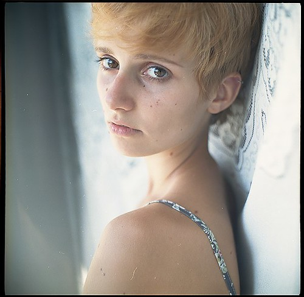
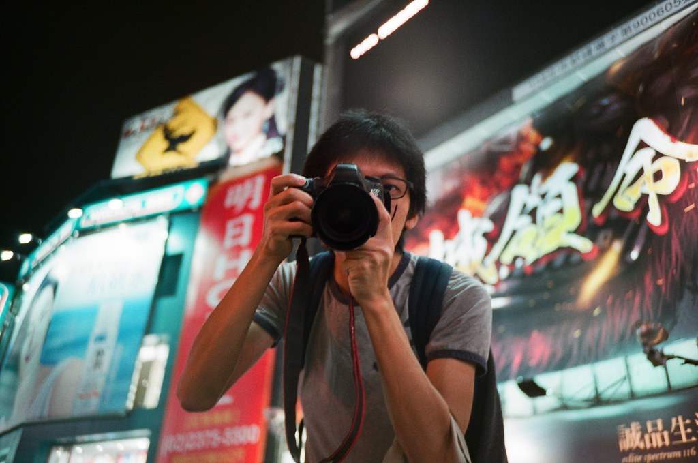
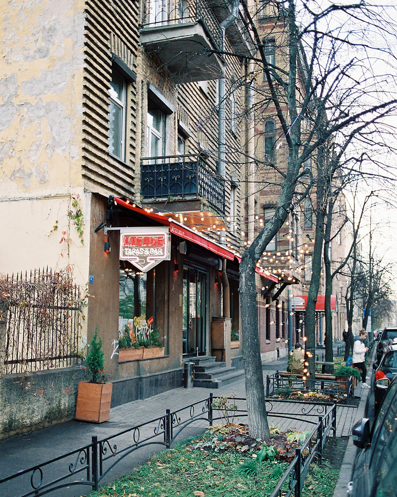
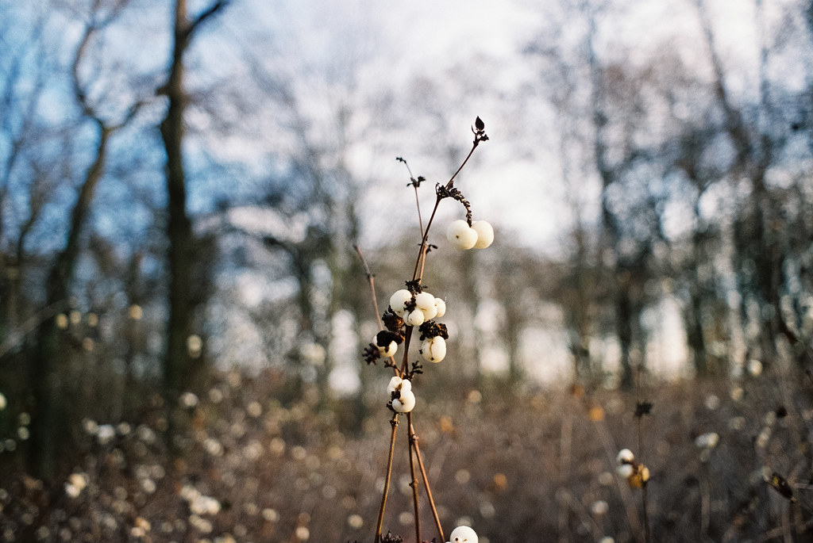
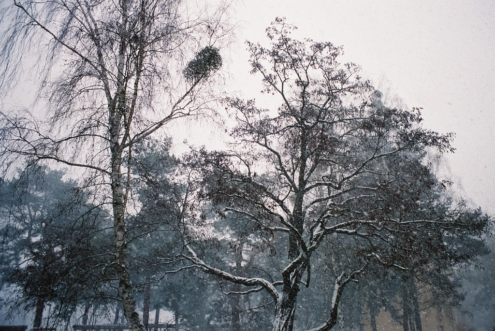
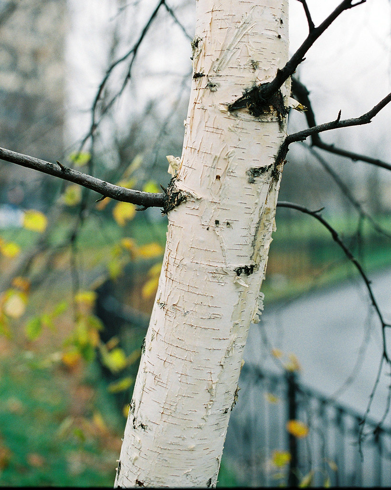
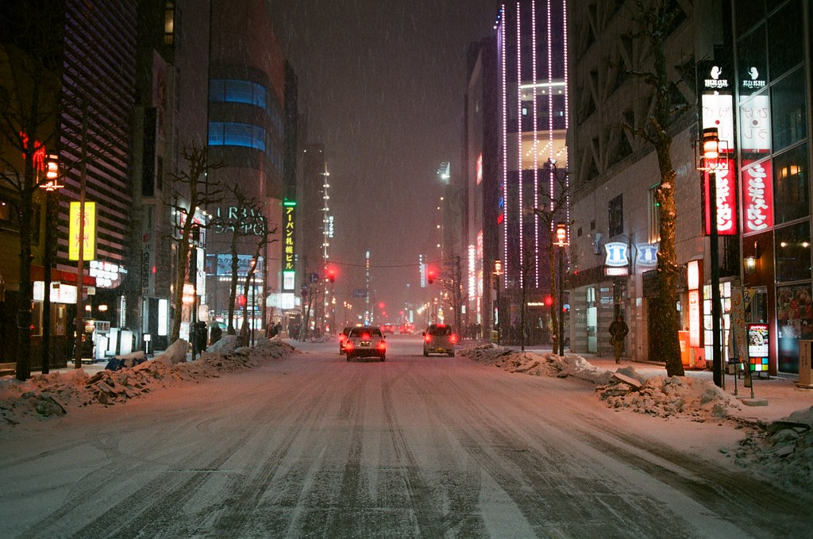

# FUJICOLOR PRO 400H

## 风格意图

Interpret FUJICOLOR PRO 400H as a scene-responsive color-negative look, not as a fixed mint, pink-wedding, cyan-shadow, or warm-brown preset. Its most defensible intent in this evidence is gentle tonal continuity with enough room for faces, white fabric, cool surroundings, foliage, and saturated accents to remain separately legible. A soft, airy result is appropriate when the original light and subject support it; the same interpretation must also be able to retain density, warm practical light, and meaningful shadow in a harder scene.

Prioritize believable relations over an imposed palette: protect what is light versus dark, warm versus cool, and skin versus its surroundings before making the image feel quiet or polished. The desired restraint is not flatness. It is a refusal to make a single scanner-like color cast or wedding-editorial exposure stand in for every subject.

## 稳定视觉特征

The stable cross-source instruction is a protection strategy rather than a measured color transform.

- Keep skin, white or pale material, foliage, cool water/sky, and warm focal objects distinguishable from one another. Softness should not turn them into one generalized pastel layer.
- Favor a calm, continuous transition through the middle and upper tones when the scene permits it. Let dark suits, rock, wood, deep foliage, and night structure remain dark when they carry subject separation.
- Preserve local color identity. Blue, green, red, yellow, ivory, and skin can all remain recognizable without becoming overly digital or uniformly desaturated.
- Use modest, controllable contrast as a starting tendency, then respond to the original scene. Neither lifted blacks nor heavy black points are stable properties of every example.

There is no stable evidence for a mandatory cyan/teal bias, pastel green, pink skin, olive shadow, warm-brown density, universal grain, or global soft focus. Those appearances vary with scene, exposure, photographer, scan/post route, and web delivery.

## 影调结构

Build the tonal hierarchy before any stylization. Let the broad midtone region carry faces, fabric, water, stone, and foliage; roll bright areas into their surroundings rather than producing abrupt digital-looking white blocks. In a naturally soft or overcast scene, this can mean quiet highlight-to-midtone transitions and subtle differences between pale water, cloud, dress, and sky.

Do not mistake soft light for a request to brighten every photograph. On a white garment, cloud, window, water, or pale wall, retain enough local structure to distinguish material from adjacent light. If a softer treatment causes fabric, skin boundaries, clouds, or reflected water to merge, stop before calling the loss of information “air.”

In hard daylight, patchy light, backlight, or night, allow shadow to retain weight. First preserve the subject’s relationship to the bright area, then make the shoulder less brittle where the original has recoverable detail. Do not flatten dark clothing, deeper skin tones, rock, foliage, or night into gray merely to make the frame resemble a low-contrast wedding delivery.

## 颜色关系

Correct color locally and conditionally. The desired outcome is separation without an artificial global correction:

- Keep cool water, cloud, blue clothing, and blue details capable of reading as cool without forcing cyan into every blue or neutral.
- Let foliage follow its light: it may be pale or gray-green in soft overcast light, yellow/olive or dense in sun and shade, and deep green in stormy or low light. Do not convert every leaf and lawn to the same mint hue.
- Preserve the energy and texture of red, orange, and yellow subjects. Do not wash a red object into brown-gray for “film softness,” and do not amplify it into fluorescent digital color.
- Let white fabric stay responsive to the scene: airy and cool-adjacent in a pale coast setting, or creamy/warm-adjacent in warm architectural shade. Preserve its structure instead of forcing absolute white neutrality.

Quiet blue-green and pale-pink combinations may be valid when the scene's light and objects contain them. They are not a general color map for people, foliage, interiors, or ordinary daylight.

## 人像与肤色

Portrait evidence in this public set is limited. Preserve natural local warmth and facial/hand separation without forcing a uniform peach or pink complexion. In window light, soft shade, or overcast light, prevent green or cyan environmental reflection from taking over skin; do this without over-warming the whole face or erasing the actual coolness of the surrounding scene.

Treat white clothing as a portrait protection object. Maintain the order among face, hands, dress/shirt, flowers, and bright background. Retain embroidery, folds, and the distinction between ivory fabric and skin rather than solving a bright frame by making all pale material equally white.

This public set has no controlled darker-skin comparison. Protect relative luminance and surface detail beside lighter skin and white clothing in the current photograph. Do not lift or flatten deeper skin solely to obtain a high-key look, and do not prescribe a universal hue, shadow tint, or warmth from this set.

In neutral indoor light, tungsten light, or low light, preserve the subject’s actual local color and tonal detail first; treat any further film-specific skin change as unvalidated.

## 不同光照、色温与光比

### 柔光、阴天与开放阴影

When the original scene is already soft, allow a quieter contrast rhythm and a more open upper range. Preserve small differences among cloud, water, white fabric, pale stone, and light skin; retain enough dark anchor in a suit, rock, tree line, or foreground to avoid a washed-out result. A pale blue-green/cream relationship may be appropriate only when it belongs to the scene rather than being added globally.

### 硬日光、斑驳光与高光比

Protect the brightness order of sunlit skin, white clothing, pale architecture, and shadow before reducing or adding contrast. Keep shadow detail that explains a face, hand, fabric, or environmental form, but let background shade stay substantial where it creates separation. Do not use one warm, dense frame as a global recipe for daylight.

### 逆光与明亮背景

Keep hands, faces, and the edge of white clothing readable against the brighter field. Preserve a bright, breathing background only while it remains distinguishable from the subject and fabric. If the subject becomes a featureless silhouette or the dress, sky, and window merge into one blank area, restore their relative structure before continuing.

### 窗边日光

Preserve the difference between the interior’s warm/neutral materials and the cooler or greener exterior. Do not force all interior shadow toward daylight blue, and do not neutralize the exterior until it loses its own light. The priority is a readable face, clothing, and colored objects across the window boundary.

### 钨丝灯、混合光与低照度

Keep motivated warm light distinct from surrounding blue, green, or dark areas instead of globally removing yellow or globally warming everything. Retain necessary dark structure and the color of practical lights. This public set does not establish a tungsten skin balance, a darker-skin tungsten treatment, or a universal low-light palette.

### 夜景与特殊曝光

Preserve light-source color and enough shadow structure for the scene to read. Do not flatten night into gray or copy intentional motion or long-exposure color spread into ordinary photographs. Neon behavior is not established by this set.

## 风光与环境题材

For water, clouds, snow, and pale weather, retain fine tonal spacing before pursuing muted color. A quiet sky or water surface can remain bright without becoming blank, while dark rock, shoreline, buildings, or tree line supply the needed anchor. Keep snow, reflections, cloud, and small warm accents distinct.

For vegetation, work from observed light and depth rather than a stock-specific green target. Foliage may be subdued behind a portrait, dense and dark in a garden, or vivid around a child’s colored objects. The stopping point is reached when foliage no longer varies by light, depth, and species, or when environmental correction contaminates skin.

In hard-light landscapes, preserve the subject color and material of red/orange objects, yellow highlights, or deep shadows. Use strong-light references to protect highlight-to-shadow relationships, not to make ordinary outdoor work redder, darker, or more contrasty.

## 调色决策顺序

1. Identify the primary subject, the dominant illuminant, the scene’s contrast, and any protection objects: faces/hands, white clothing, neutral materials, water/sky, foliage, or a strong warm color.
2. Establish exposure and tonal order. Make faces, hands, and fabric readable; then preserve the separation among pale highlights, midtones, and meaningful dark anchors.
3. Correct local color relationships. Prevent unwanted environmental spill into skin, retain the scene’s motivated warm/cool difference, and preserve the identity of foliage, blue surroundings, and saturated objects.
4. Apply the light-specific branch: quiet transitions for soft light, robust subject-to-shadow separation for hard or patchy light, balanced subject/background readability for backlight, and motivated mixed-light contrast for interiors and night.
5. Compare only the relevant reference role, not its entire delivery look. A portrait, a night street, and a snowy landscape cannot be averaged into one preset.
6. Finish with a restraint pass. Remove any global cast, contrast move, grain simulation, or softness that does not improve the current subject-light relationship.

## 主体保护与停止信号

Protect faces and hands first, then the material structure of white clothing, the local depth of foliage, and the separations that explain water, sky, stone, wood, or an intentional warm object.

Stop or reverse the treatment when any of the following appears:

- “Airiness” has erased lace, fabric folds, skin boundaries, cloud texture, water layers, or a bright object’s edge.
- Skin becomes uniformly pink/orange, picks up a global green/cyan cast, or loses its local relation to adjacent light and darker skin.
- Deeper skin is lifted into a flat high-key value or allowed to collapse without surface detail in order to preserve a bright background.
- All foliage becomes a single mint/teal color, or red/yellow subjects lose their material color and become brown-gray.
- A hard-light or night scene is made gray and flat by lifted shadows, or an ordinary scene is made heavy by borrowing the dense warm treatment of one reference.
- Grain, blur, border, collage layout, pinhole distortion, or web-compression artifacts become more visible than the actual subject.

## 公开参考图与使用边界

以下样片由原作者标注为对应胶片拍摄，并按逐张核对过的 CC 许可再分发。不要从任一张样片单独推导固定色温、颗粒、扫描流程或 Lightroom 参数。作者、原图与许可见各图说明及 package.json。

### 01 — Lisa

摄影师：Ustynskyi · [原图](https://www.flickr.com/photos/99473925@N07/13223092445) · [CC BY 2.0](https://creativecommons.org/licenses/by/2.0/)。这是一张具体曝光与扫描条件下的实拍参考，不是该胶片的统一色彩标准。

### 02 — 我 西門町 Taipei, Taiwan / FUJICOLOR PRO 400H / Lomo LC-A+

摄影师：Toomore · [原图](https://www.flickr.com/photos/92438116@N00/26276536681) · [CC BY 2.0](https://creativecommons.org/licenses/by/2.0/)。这是一张具体曝光与扫描条件下的实拍参考，不是该胶片的统一色彩标准。

### 03 — Fuji Pro 400H - Takumar 28mm F3.5 - Praktica MTL5B 4

摄影师：Mar Yung · [原图](https://www.flickr.com/photos/149409562@N06/30058122288) · [CC BY 2.0](https://creativecommons.org/licenses/by/2.0/)。这是一张具体曝光与扫描条件下的实拍参考，不是该胶片的统一色彩标准。

### 04 — 小樽 天狗山 Otaru Japan / FUJICOLOR PRO 400H / Nikon FM2

摄影师：Toomore · [原图](https://www.flickr.com/photos/92438116@N00/26357279900) · [CC BY 2.0](https://creativecommons.org/licenses/by/2.0/)。这是一张具体曝光与扫描条件下的实拍参考，不是该胶片的统一色彩标准。

### 05 — Canon A-1 + Fuji Pro 400H

摄影师：grenez · [原图](https://www.flickr.com/photos/59016981@N07/43932067010) · [CC BY 2.0](https://creativecommons.org/licenses/by/2.0/)。这是一张具体曝光与扫描条件下的实拍参考，不是该胶片的统一色彩标准。

### 06 — Fuji Pro 400H - Takumar 28mm F3.5 - Praktica MTL5B 5

摄影师：Mar Yung · [原图](https://www.flickr.com/photos/149409562@N06/43022366545) · [CC BY 2.0](https://creativecommons.org/licenses/by/2.0/)。这是一张具体曝光与扫描条件下的实拍参考，不是该胶片的统一色彩标准。

### 07 — Fuji Pro 400H - Takumar 28mm F3.5 - Praktica MTL5B 2

摄影师：Mar Yung · [原图](https://www.flickr.com/photos/149409562@N06/43208974004) · [CC BY 2.0](https://creativecommons.org/licenses/by/2.0/)。这是一张具体曝光与扫描条件下的实拍参考，不是该胶片的统一色彩标准。

### 08 — Canon A-1 + Fuji Pro 400H

摄影师：grenez · [原图](https://www.flickr.com/photos/59016981@N07/31877934948) · [CC BY 2.0](https://creativecommons.org/licenses/by/2.0/)。这是一张具体曝光与扫描条件下的实拍参考，不是该胶片的统一色彩标准。

### 09 — Fuji Pro 400H - Takumar 28mm F3.5 - Praktica MTL5B

摄影师：Mar Yung · [原图](https://www.flickr.com/photos/149409562@N06/43552234925) · [CC BY 2.0](https://creativecommons.org/licenses/by/2.0/)。这是一张具体曝光与扫描条件下的实拍参考，不是该胶片的统一色彩标准。

### 10 — 札幌 Sapporo Japan / FUJICOLOR PRO 400H / Nikon FM2

摄影师：Toomore · [原图](https://www.flickr.com/photos/92438116@N00/39255792534) · [CC BY 2.0](https://creativecommons.org/licenses/by/2.0/)。这是一张具体曝光与扫描条件下的实拍参考，不是该胶片的统一色彩标准。
