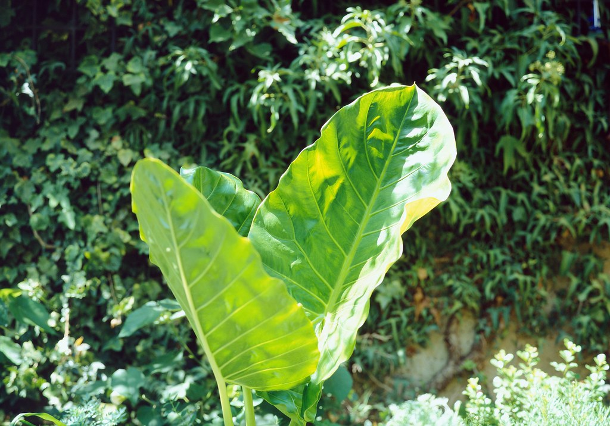
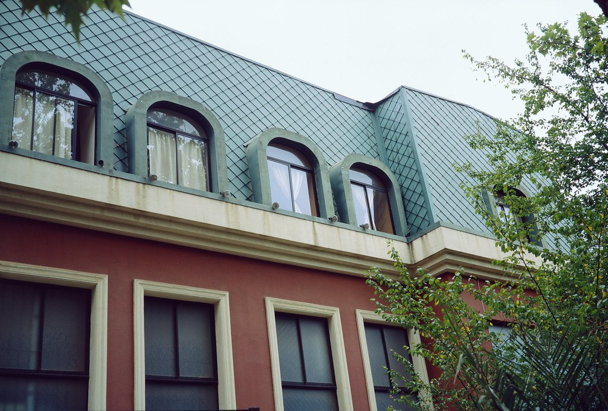
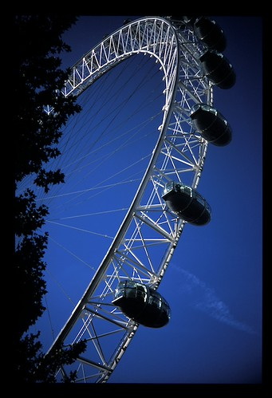
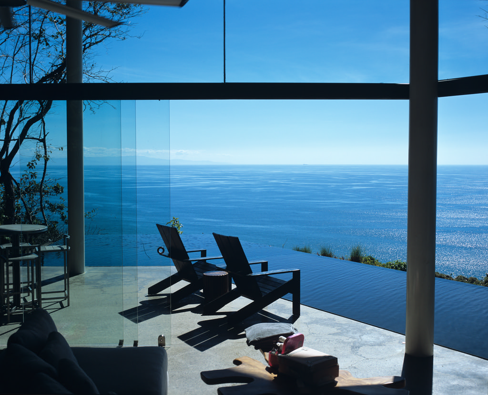
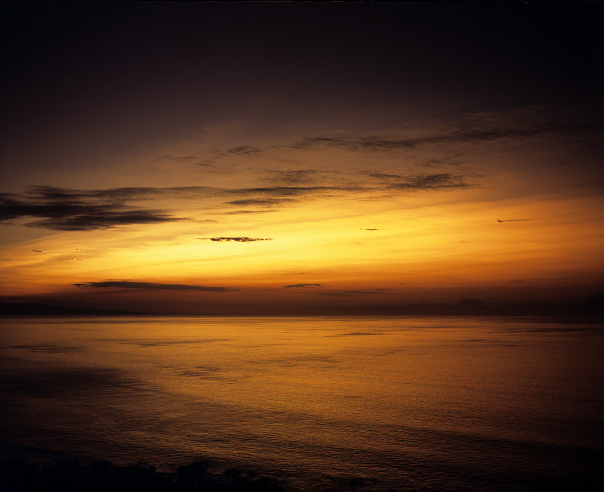
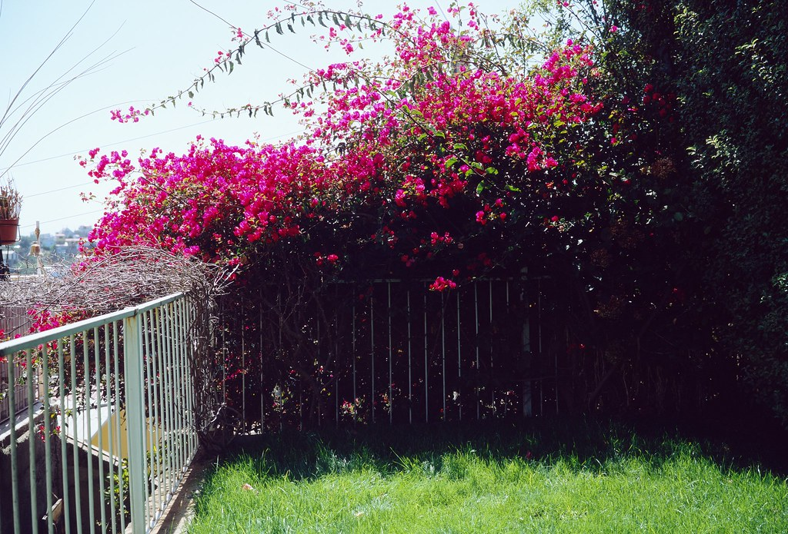
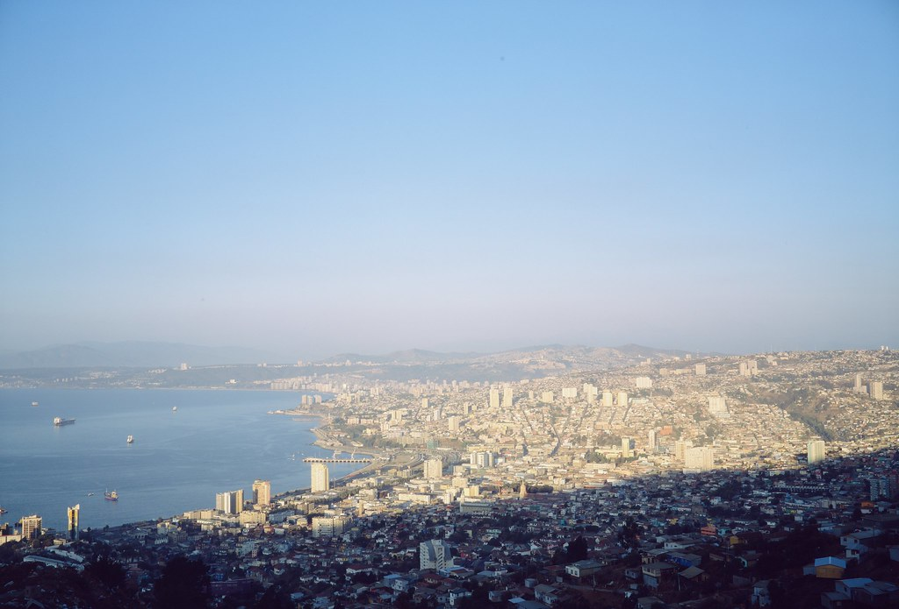
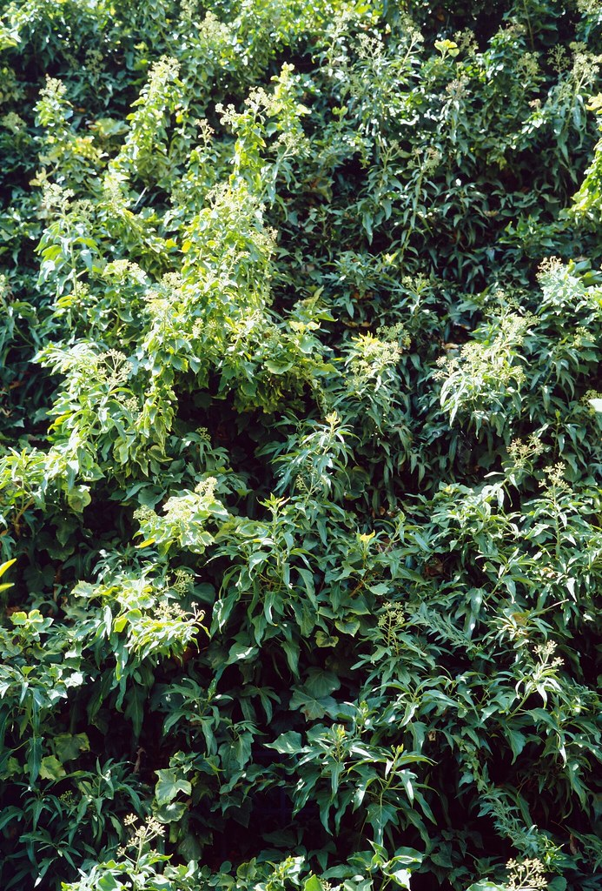
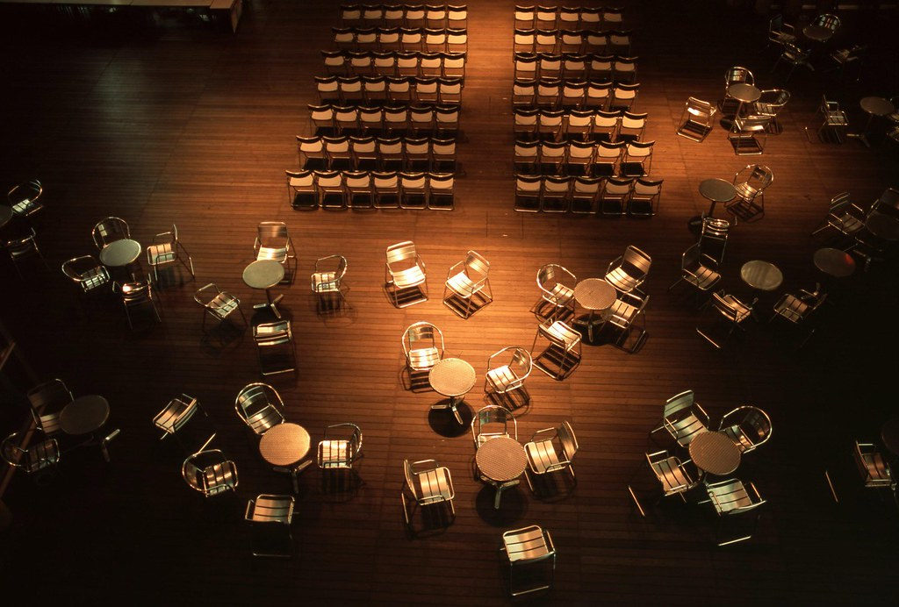
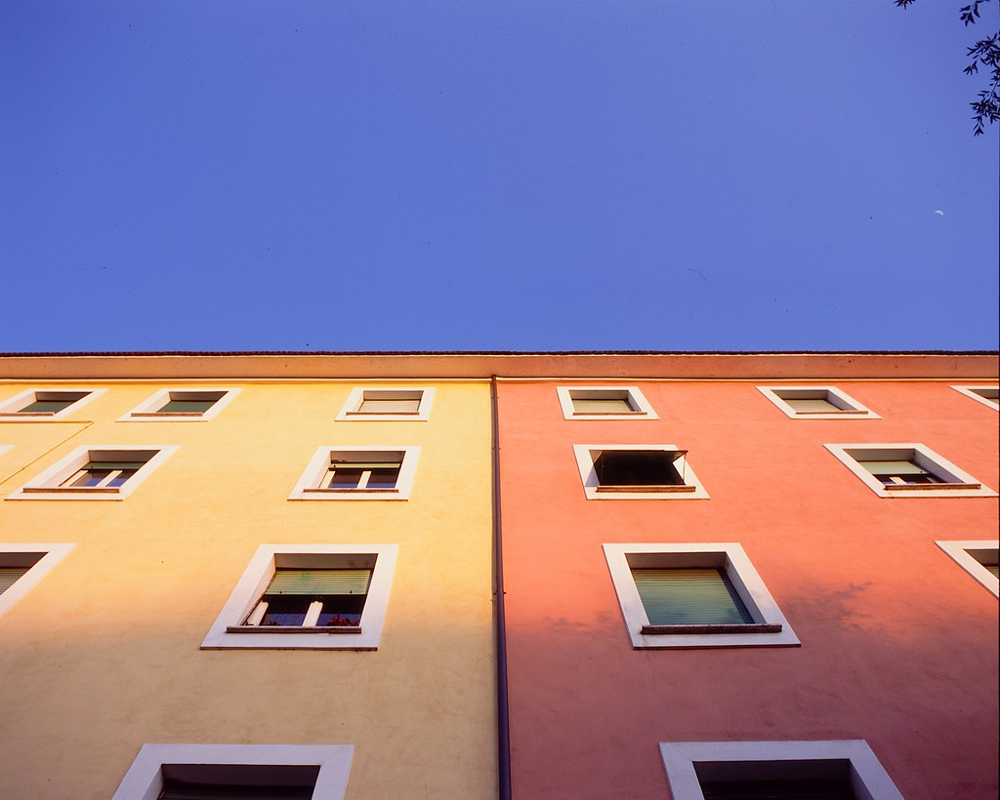

# FUJICHROME Provia 100F

## 风格意图

把目标理解为一张曝光位置被认真安排的反转片式画面：现场已有的暖色、冷色和中性物彼此清楚，亮处有位置，深处可以有重量，但不把画面套进统一的青绿、橙粉或怀旧色罩。它追求的是有边界的色相和明暗关系，而不是把所有颜色推到最大，或以抬黑、软焦和颗粒来制造“胶片感”。

日光、开阔阴影和建筑中的暖物可与蓝、冷灰或绿色环境分开；重要高光不应被牺牲来换取饱和度；非叙事性阴影不必被救成灰。公开样片来自不同曝光、库存状态和扫描流程，其中有明确标注为过期胶片的照片；它们只用于观察条件性的颜色关系，不能设定新鲜库存的固定色相、密度或肤色倾向。

## 稳定视觉特征

- 优先保留**颜色之间的距离**。在画面确实同时有暖木、砖红、黄、粉色、蓝天、冷灰石材或绿色植被时，让它们各有名称和层次，而不是都被吸到一种综合色偏里。
- 中性物要保留现场光线留下的轻微冷暖，而不是被统一加暖、加粉或加青。白帐篷、灰石、金属、高光水面和浅色衣物应仍像同一场景中的不同材料。
- 饱和色可以有密度，但先保留物体内部的明暗与纹理。红、橙、黄和粉不应塌成一片荧光暖色；绿色不应吞掉邻近的皮肤、灰石或蓝色；天空和水也不应被强制改成同一种深青蓝。
- 可以让深部保持深，而不要自动做成负片式的全面阴影恢复；但这不是“越黑越 Provia”。深部是否保留细节取决于人脸、前景信息和构图是否需要它。
- 细节的目标是干净、可信的摄影细节，而不是扫描锐化、微对比或颗粒的复刻。现有文件无法可靠定义颗粒、锐度或一套固定的质感处理。

## 影调结构

先为真实的亮部和主体放置影调，再决定黑位能走多深。白色建筑、衣物、云、浪花或浅岩需要保留过渡；落日与剪影在构图明确需要时可以成立。两者不能互相替代。

低光比或柔光画面应保留小幅的中间调、花瓣、肤色、云层和冷灰石材的差异，不要为了“反转片”硬造黑白端。中光比画面可让主体和环境以局部亮度、色相与材质分开。高光比画面应先问：黑暗区域是否承担剪影或背景功能？若不是，保留人物和叙事前景所需的读性；若是，允许它沉下去，同时防止关键亮部断成无层次的白块。

不要从任何一张风光图推断固定宽容度或扫描中的阴影表现。这里可迁移的是高光优先、深部有意图的影调选择，不是对动态范围的承诺。

## 颜色关系

蓝色、青色和绿色必须随现场条件变化。晴天可以保持干净、偏冷的蓝与暖木或黄土的对照；阴天、开阔阴影和海岸可以是更安静的灰蓝、蓝紫或冷灰；植被可以从深冷绿到受光草绿。不要把其中任一种样片的绝对色相或饱和量变成全局预设。

暖色是物体和光线的关系，而不是全局白平衡。若场景有红墙、金色装饰、花朵、标识、木材或晚霞，可保护暖色内部从黄、橙、粉到深红的层次，并让它们与相邻蓝、绿或灰石分开。若场景没有真实暖色主体，不要凭空添加红橙密度。

落日中的黄、橙、粉和淡紫可在真实逆光下形成连续过渡；阴天海岸中的紫灰天空也可以保持低密度。这两类结果表明“按光线保留色温分层”，不能证明任何照片都应更暖、更粉、更蓝或更饱和。

## 人像与肤色

人像的首要目标是让脸、颈部、手和重要衣物与环境反射色分开。面对冷墙、树荫、蓝水或冷灰环境，先使局部肤色和近中性物可信，再限制青绿反射侵入皮肤；不要用整张图加暖来解决局部环境问题。肤色应保留真实的明暗、红润和材料感，而不是变成统一的橙色、粉色或灰绿块。

在硬日光、斑驳阴影或高反差环境中，先保护受光面上的肤色与白衣、浅衣物的过渡，允许背景阴影比人物更深。鲜艳粉红、红色或蓝色衣物可以保持其独立性，但不应与皮肤一起被推到失去纹理。直闪活动照只用于这个特定条件：先约束脸部和白衣的硬亮点，保留不同肤色之间的相对关系，并让深背景仍服务于现场；不要把直闪的冷暗部、纯黑背景或油亮高光带回自然光人像。

这组公开样片缺少受控的跨肤色肖像比较。处理人物时应先看当前原图的皮肤与主光，保住局部明度和材质；不要把任何一张参考图当作普遍的肤色配方。

## 不同光照、色温与光比

### 硬日光与中高光比

如果当前图像有亮白的帐篷、墙面、衣物、云或浅岩，先保护这些高光的层次，再有限度地提高已有暖色与冷色、受光面与阴影的区分。人物在日光/树影交界时优先保留脸和衣物的读性；背景可以更深，但不要把人压成与背景同样的黑。蓝天、绿植、红黄标识和中性地面能够共存时，重点是分离而不是把每一种颜色都继续加浓。

### 柔光、开阔阴影与阴天

如果光线原本平和，保留花瓣、肤色、云层、冷灰石材和浅色建筑之间的微小色差，允许整体比硬日光安静。不要用强局部对比伪造阳光，也不要为了消除冷感而全局加暖。此条件下可让背景保持一点冷灰或蓝紫，只要人脸、白物和主要中性物没有被拖向同一种蓝绿。

### 逆光、日落与水面反光

只有在画面确有暖色光源、落日或逆光轮廓时，才让暖亮处成为局部中心，并保护它向粉、紫、灰蓝天空或冷暗轮廓的连续变化。剪影必须由构图支持；若主体不是刻意剪影，先保住脸和衣物，再决定背景亮部与暗部。不要将这一支的橙粉天空、近黑前景或水面暖反射应用于普通日光、阴天或室内图。

### 室内环境光、钨丝灯与混合光

室内环境光先跟随可见的主光和真实中性关系，再局部保护肤色、白衣和颜色明确的物体。可以保留木材、红墙、玩具或织物的密度，但不要让它们替整张图决定白平衡。公开样片没有受控的新鲜 Provia 100F 钨丝灯或混合光序列：这两类目标图应先忠实于自身光源和主体，再把本风格限制为颜色分离与高光/主体保护的原则，不能推导固定暖偏、固定青橙平衡或固定阴影色。

### 直闪、暮色与低照度

直闪是独立条件，不是环境光的加强版。限制脸、白衣和高反射面变得刺眼；保留深背景、肤色和有颜色的衣物之间的层次。暮色和低照度时，让局部光源、暖窗光或火光与冷暗环境有距离，并允许非关键背景保持暗；若暗部有主体，先决定主体需要多少读性，再处理背景。没有霓虹样片，不要给中性夜景人为添加青、洋红或过强的局部饱和。

## 风光与环境题材

风光优先保留真实天气与空间距离。天空、水面、远山、石材、树木和前景应随着光线保持各自的冷暖和明暗层次；不要为了“清晰”把远景的空气感和每一层局部对比都推到前景强度。山地和海岸可使用暖岩/暖叶与冷山/冷天的关系，但不应照抄某一位摄影师的雾色、青蓝或暗部密度。

在绿植为主的画面中，检查叶片、草地或苔藓仍有内部明暗，且不污染灰石、天空和皮肤。画面有高饱和花、红墙、金色屋檐或彩色标识时，可以把它们作为局部锚点，保留红、黄、蓝绿之间的层次；没有这些对象时，不要凭风格增加暖色。干净蓝天与受光木材、阴天紫灰与潮滩、以及暖岩与风暴山都可作为不同天气下的条件关系，而不是统一的风光调色公式。

## 调色决策顺序

1. 先读当前原图：确认主体、真实主光、色温、光比、重要中性物和需要保住的高光/阴影信息。把直闪、强逆光、窗口亮斑、反射光等视为现场条件，而不是待复制的胶片特征。
2. 先建立影调位置。为关键高光留出过渡；根据主体和构图决定哪些阴影可以保持深、哪些必须仍可读。不要先靠抬黑或压黑建立气氛。
3. 选择光线分支：硬日光强调高光纪律和场景已有的分离；柔光强调微差；逆光只在真实暖光下允许局部暖亮与轮廓；室内、闪光和低照度各自独立处理。
4. 在真实对象上建立颜色关系。先让白、灰、肤色和材料可信，再分别处理天空/水、植被、暖色物体；只加强画面已经拥有的色彩距离。
5. 对人物做局部复核：脸、颈、手、白衣和高饱和衣物是否仍有明暗和色相空间，且没有被环境冷色或全局暖化污染。
6. 对环境做复核：天空、水、石材、木材和植被是否仍符合当前天气与距离；远景没有被过度拉近，饱和物体没有失去纹理。
7. 最后移除任何并非目标影像自身需要的模拟痕迹，并在出现下列停止信号时回退最近的全局性调整，改用更小范围、受光线约束的修正。

## 主体保护与停止信号

优先保护：人脸和手、白衣与浅色主体、关键高光的渐变、叙事性阴影、以及高饱和物体内部的纹理。任何增强都应服从这些对象，而不是反过来。

停止或回退，如果出现以下任一情况：

- 所有场景都得到相同的青绿阴影、异常浓绿植被和强粉色；这会把单张样片的库存、曝光或扫描差异误当成默认风格。
- 普通日光、阴天或室内被整体染成橙粉落日；暖色应由实际光源或暖色主体触发。
- 为了对比而令白衬衫、帐篷、云、浪花、浅岩或人脸失去过渡，或令应当可读的前景沉成死黑。
- 皮肤被蓝绿反射吞没，或为补救而变成不真实的橙/粉色块；不同肤色之间原有的相对明暗和饱和度被拉平。
- 绿色、红色、粉色、蓝天或水面变成没有材料纹理的一块纯色，或灰石、金属和白物也被统一染色。
- 出现幻灯片边框、黑边密度、尘点、毛发、划痕、扫描色边、强暗角、软焦边缘、水印、JPEG 纹理、伪颗粒或过度扫描锐化。这些不是应迁移的外观。
- 直闪、单一夕阳、单一摄影师的滤镜/曝光选择或某个来源的裁切开始支配所有条件。

## 公开参考图与使用边界

以下样片由原作者标注为对应胶片拍摄，并按逐张核对过的 CC 许可再分发。不要从任一张样片单独推导固定色温、颗粒、扫描流程或 Lightroom 参数。作者、原图与许可见各图说明及 package.json。

### 01 — Provia 100f test 1

摄影师：Omar_Burgos_D · [原图](https://www.flickr.com/photos/95383788@N03/49572465372) · [CC BY-SA 2.0](https://creativecommons.org/licenses/by-sa/2.0/)。这是一张具体曝光与扫描条件下的实拍参考，不是该胶片的统一色彩标准。

### 02 — Provia 100f test 7

摄影师：Omar_Burgos_D · [原图](https://www.flickr.com/photos/95383788@N03/49572465772) · [CC BY-SA 2.0](https://creativecommons.org/licenses/by-sa/2.0/)。这是一张具体曝光与扫描条件下的实拍参考，不是该胶片的统一色彩标准。

### 03 — london

摄影师：osamukaneko · [原图](https://www.flickr.com/photos/22633661@N08/2624106079) · [CC BY 2.0](https://creativecommons.org/licenses/by/2.0/)。这是一张具体曝光与扫描条件下的实拍参考，不是该胶片的统一色彩标准。

### 04 — Room with a View - Costa Rica (GF670 / Provia)

摄影师：Harald Philipp · [原图](https://www.flickr.com/photos/65969414@N08/52526751259) · [CC BY 2.0](https://creativecommons.org/licenses/by/2.0/)。这是一张具体曝光与扫描条件下的实拍参考，不是该胶片的统一色彩标准。

### 05 — Provia Sunrise (MF GF670 / Provia)

摄影师：Harald Philipp · [原图](https://www.flickr.com/photos/65969414@N08/52525793903) · [CC BY 2.0](https://creativecommons.org/licenses/by/2.0/)。这是一张具体曝光与扫描条件下的实拍参考，不是该胶片的统一色彩标准。

### 06 — Provia 100f test 3

摄影师：Omar_Burgos_D · [原图](https://www.flickr.com/photos/95383788@N03/49572239236) · [CC BY-SA 2.0](https://creativecommons.org/licenses/by-sa/2.0/)。这是一张具体曝光与扫描条件下的实拍参考，不是该胶片的统一色彩标准。

### 07 — Provia 100f test 4

摄影师：Omar_Burgos_D · [原图](https://www.flickr.com/photos/95383788@N03/49572239196) · [CC BY-SA 2.0](https://creativecommons.org/licenses/by-sa/2.0/)。这是一张具体曝光与扫描条件下的实拍参考，不是该胶片的统一色彩标准。

### 08 — Provia 100f test 2

摄影师：Omar_Burgos_D · [原图](https://www.flickr.com/photos/95383788@N03/49572465697) · [CC BY-SA 2.0](https://creativecommons.org/licenses/by-sa/2.0/)。这是一张具体曝光与扫描条件下的实拍参考，不是该胶片的统一色彩标准。

### 09 — Pentax645+75mm Provia 09p.jpg

摄影师：midorisyu · [原图](https://www.flickr.com/photos/9802162@N03/3047739994) · [CC BY 2.0](https://creativecommons.org/licenses/by/2.0/)。这是一张具体曝光与扫描条件下的实拍参考，不是该胶片的统一色彩标准。

### 10 — 3 colors and the moon

摄影师：Un ragazzo chiamato Bi · [原图](https://www.flickr.com/photos/57688343@N00/18029320402) · [CC BY-SA 2.0](https://creativecommons.org/licenses/by-sa/2.0/)。这是一张具体曝光与扫描条件下的实拍参考，不是该胶片的统一色彩标准。
