# FUJICOLOR Superia X-TRA 400

## 风格意图

把这款胶片理解为一种有边界的日用消费彩色负片观感，而不是固定的富士色彩预设。目标是在街头、旅行、家庭记录和园景中保留现场光线的差异：亮处有过渡，正常低至中反差场景的中间调仍能分开，冷的天空、水面或阴影可与土色、木材、红黄物体和肤色共存。画面可以有生活感和不完美，但不靠统一的青绿、洋红、橙色、厚颗粒或软焦来制造它。

## 稳定视觉特征

- 跨来源最稳的不是某个固定色相，而是局部关系：冷色区域通常保持安静，暖色物体和肤色仍有辨识度，彼此不被压成一层综合色罩。
- 在常见日光、阴天、阴影和中等光比下，优先让物体之间的中间调与色相距离可读；水、石、衣物、植被和红黄细节不必同等鲜艳，但应各有位置。
- 明部应避免数码式的硬白边和生硬对撞。高光有可感知的过渡时就保护它；真正的剪影、深影和低照度黑位则可随场景保留，不承诺把每一个暗部救回。
- 更高色度、边缘表现或特殊质感若只见于一张样片或一种冲扫流程，不能升格为默认外观。

## 影调结构

低反差、阴天或柔光时，以相近的中间调承载信息。保住浅天空、浅石材、浅色毛发或衣料与相邻背景之间的微差，让远景自然退后；不要为了“胶片感”把画面压成灰雾，也不要用过强局部反差把雾气和柔光打碎。

中等光比是最可迁移的日常范围。让主体、关键中性色和局部暖/冷物体有清楚层次，但不要把黑位一律抬平或把白位一律压脏。画面应保留现场已有的明暗结构，而不是套一个固定的低对比曲线。

硬日光、逆光或低照度时，先决定深影是构图的一部分还是需要读出的主体背景。保护白墙、云、灯具、反光水面或面部亮部附近的过渡；同时允许真正的黑影、轮廓和地下空间保有重量。停止于亮部变成没有层次的纯白，或为了保亮部而让中间调和红黄物体都显得脏灰。

## 颜色关系

让现场决定冷色的具体走向：天空、水、远景或阴影可以偏灰蓝、蓝青、淡紫灰或接近中性，不能被统一推成一种青色。与之相邻的土褐、木色、红、橙、黄和皮肤应保持自己的局部温度与明度，而不是被一起推成高饱和橙色。

绿色不是一个固定的“Superia 绿”。阴天海岸、城市绿地、树荫和花园的绿色可以分别收敛、偏灰、偏暖或被冷影切开。保留叶片、树皮、石材、水面和人物衣物之间的分层；若绿色开始吞没石材纹理、肤色或相邻颜色，应退回。

中性色也没有可迁移的固定白平衡。白色、灰墙、云、金属和石材应以当前光源为锚点，保留可理解的局部偏暖或偏冷，而不是制造统一的粉白高光、青阴影或洋红罩染。

## 人像与肤色

人物优先于把背景做成某一种富士颜色。先辨认每张脸所在的主光区、脸部亮面与阴影、衣物和邻近反射色；保留原有肤色的明暗起伏与自然红润，再处理环境色。让人物通过相邻背景的明度和色彩关系分离，优先于全局锐化、全局去色或全局加暖。

阴天、开放阴影和混合光中的肤色不应被灰紫天光、浓绿树荫或冷色门外光整体灌染。硬日光或半逆光的人像应先保护额头、颧骨、鼻梁等亮面与面部阴影之间的连续性，避免把人脸和红色建筑、白色墙面一起推红或一起压暗。室内群像则先保住每个人、深浅衣物和墙面的明度位置，再克制综合色偏。

这组公开参考有人物环境照，但没有中性、受控的跨肤色肖像系列。因此不要把任何单张人物的肤色写成标准肤色，也不要以钨丝灯、低照度近景或纯窗边人像的固定处理冒充已有证据。

## 不同光照、色温与光比

- **硬日光与高反差：** 先保护人物亮面、白墙/石阶、红黄标识和蓝天之间的分离。阴影可偏深且可偏冷，但应按主体需要保留可读结构；不要把所有深影拉成浅灰，也不要把高光压成污灰。
- **阴天、柔光与低反差：** 减少不必要的局部硬度，让浅色、中间调和远景有呼吸。保留面部、毛发、草地、石材和水面之间的细微差异；停止于画面失去主体或变成无黑位的雾灰。
- **开放阴影与斑驳光：** 按区域而非整幅图处理。保护主体的面部/木材暖调以及直射亮斑，限制深绿或蓝色环境反射扩散到皮肤和中性物；不要用一个全局白平衡把阳光与阴影拉到同一种温度。
- **逆光：** 先决定人物是需要读出面孔，还是应保留轮廓。保护光边、天空/水面的过渡和关键红色细节；若剪影是画面意图，不必硬拉开。不要人为加入彩色 flare。
- **室内与混合光：** 允许暖墙、木材、人脸与门外冷光、灰蓝金属或深衣物同时存在。按脸部所在主光区和中性物件调整，再限制邻近灯光污染；不要强制全图中性。
- **低照度：** 保留夜明前、地铁或地下空间本来的暗度，保护主光源周围的过渡、少量有意义的色点和需要读出的中间调。局部荧光绿、冷暗影和颗粒感必须先被视为现场、曝光与交付的组合，不是通用色偏或颗粒目标。

## 风光与环境题材

在山地、海岸、街道、园景和水面中，优先保留材质与距离关系：浅雾/云与远山可自然退后，水面可冷静，土壤、木材和石材仍有纹理，红桥、锦鲤、招牌或衣物可成为局部锚点。不要把全部环境做成青橙电影色，也不要把复杂植被统一成荧光绿或死橄榄绿。

反射与斑驳高光需要同时容纳亮面、深水/深叶和小面积红黄细节。到红黄失去纹理、蓝色失去层次，或植被吞掉石材和人物衣物时停止增加色彩或局部对比。雾、阴天和远景层次不需要被全局清晰度改造成干燥晴天。

## 调色决策顺序

1. 先判断当前原图的主光与光比：硬日光、柔光/阴天、开放阴影、逆光、斑驳光、室内混合光或低照度；同时标出人物脸部、关键中性色、最亮面和最深但仍应可读的区域。
2. 先建立明暗意图。低光比时保护中间调微差；高光比时保护亮部过渡及有意的深影。不要从任何参考图复制黑位、颗粒、边缘或扫描色偏。
3. 再建立局部冷暖和色相关系。让输入照片的光源决定中性色与冷色区域，保住相邻暖色、肤色、红黄物体和植被的区别，限制无依据的全局青、绿、洋红或橙偏。
4. 最后局部保护主体：先脸部与肤色，再白色/灰色参照物、衣物以及重要的红黄、蓝青或绿色物体。需要分离人物时，优先调整近旁背景关系，不以全局处理牺牲其余场景。
5. 回看画面是否仍像原本的光线：高光是否有过渡、阴影是否有意图、人物是否自然、颜色是否仍彼此分离。若效果依赖耀斑、污点、画幅边缘、网页压缩或某一特定扫描外观，就撤回该变化。

## 主体保护与停止信号

- 把所有天空、水、白墙和阴影统一推青，或把所有人物推橙粉时停止；这会消除不同光源和不同人物本有的关系。
- 柔光场景若因压黑或局部硬化而失去脸部、雾、浅石和草地层次，或高反差场景若因抬黑而失去有意剪影，都应回退。
- 红桥、锦鲤、庙宇、招牌或红衣一旦成为无纹理色块，或绿色开始吞没石材、衣物和人物，就降低局部色彩强度而不是继续叠加。
- 不复制任一样片的边缘失光或柔化，不制造彩色 flare，不仿制灰尘、划痕、网页噪点、过度锐化或特定交付尺寸的质感。
- 对钨丝灯人像、纯窗边人像、低照度近景人像和霓虹，若没有当前原图自身的可靠依据，就只做现场合理的局部保护，不声称这是本胶片已经验证的响应。

## 公开参考图与使用边界

以下样片由原作者标注为对应胶片拍摄，并按逐张核对过的 CC 许可再分发。不要从任一张样片单独推导固定色温、颗粒、扫描流程或 Lightroom 参数。作者、原图与许可见各图说明及 package.json。

### 01 — Lovers Bench Balatonszárszó

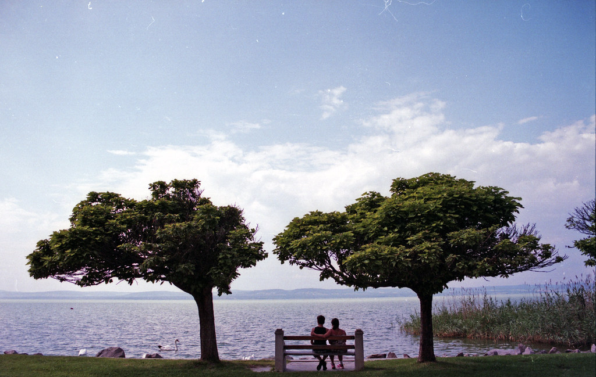

摄影师：brenkee · [原图](https://www.flickr.com/photos/55128416@N05/14360392248) · [CC0 1.0](https://creativecommons.org/publicdomain/zero/1.0/)。这是一张具体曝光与扫描条件下的实拍参考，不是该胶片的统一色彩标准。

### 02 — Budapest Eye

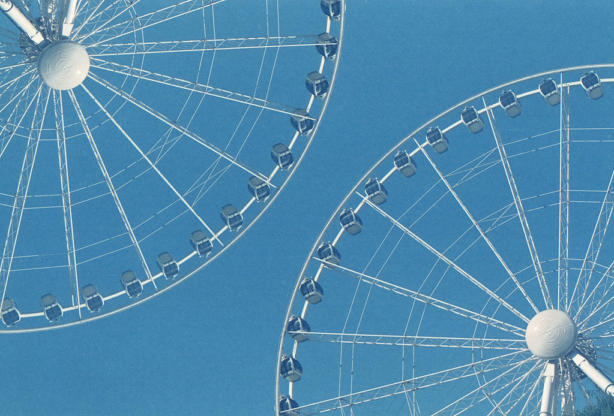

摄影师：brenkee · [原图](https://www.flickr.com/photos/55128416@N05/18279240273) · [CC0 1.0](https://creativecommons.org/publicdomain/zero/1.0/)。这是一张具体曝光与扫描条件下的实拍参考，不是该胶片的统一色彩标准。

### 03 — Loneliness

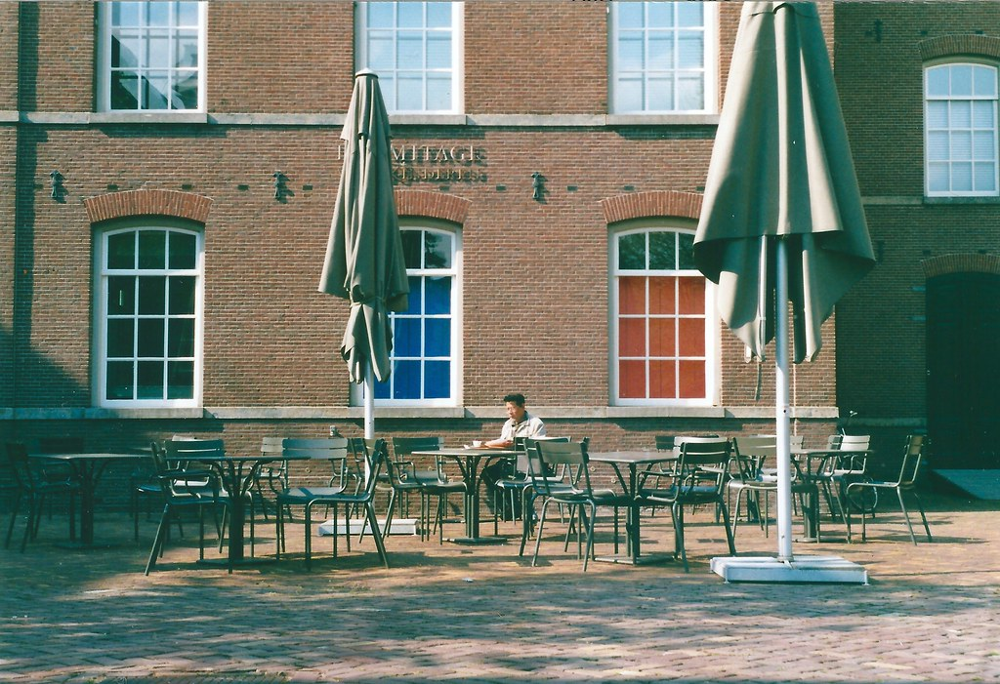

摄影师：akio.takemoto · [原图](https://www.flickr.com/photos/30719244@N06/14666188844) · [CC BY-SA 2.0](https://creativecommons.org/licenses/by-sa/2.0/)。这是一张具体曝光与扫描条件下的实拍参考，不是该胶片的统一色彩标准。

### 04 — knot in the rain

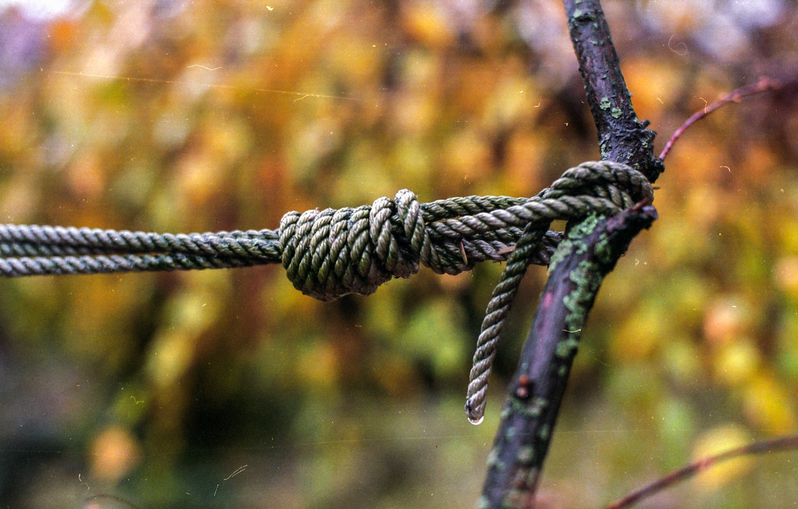

摄影师：brenkee · [原图](https://www.flickr.com/photos/55128416@N05/16028483951) · [CC0 1.0](https://creativecommons.org/publicdomain/zero/1.0/)。这是一张具体曝光与扫描条件下的实拍参考，不是该胶片的统一色彩标准。

### 05 — Kebabs on grill

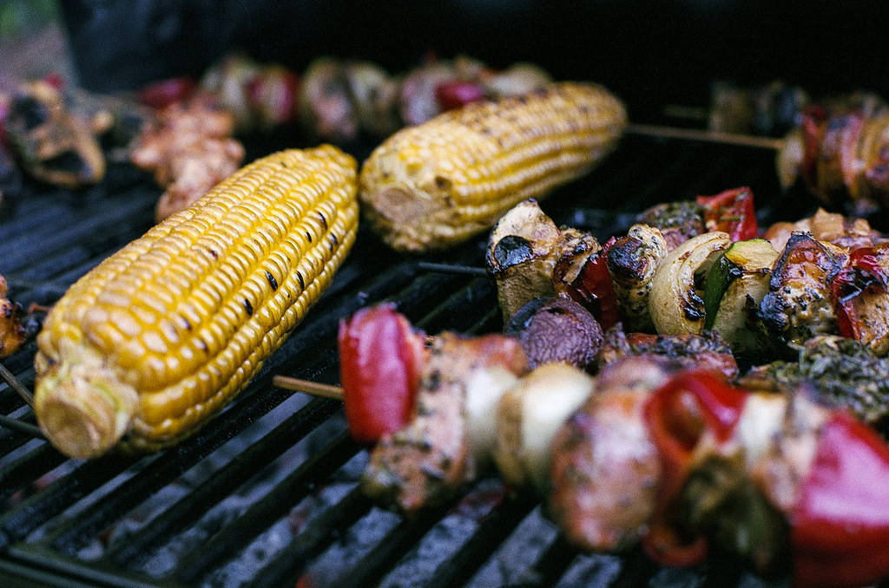

摄影师：brenkee · [原图](https://www.flickr.com/photos/55128416@N05/29448503100) · [CC0 1.0](https://creativecommons.org/publicdomain/zero/1.0/)。这是一张具体曝光与扫描条件下的实拍参考，不是该胶片的统一色彩标准。

### 06 — M. vs. Candyfloss

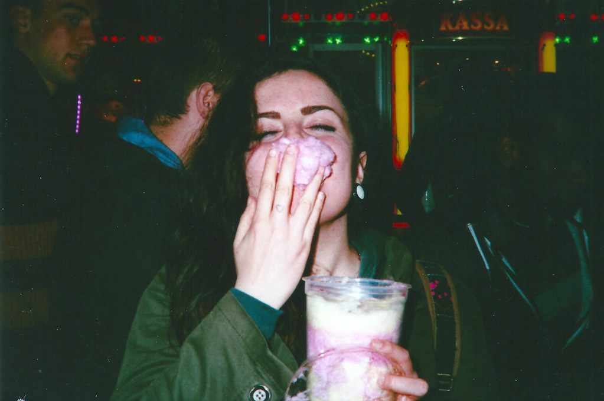

摄影师：akio.takemoto · [原图](https://www.flickr.com/photos/30719244@N06/14649070217) · [CC BY-SA 2.0](https://creativecommons.org/licenses/by-sa/2.0/)。这是一张具体曝光与扫描条件下的实拍参考，不是该胶片的统一色彩标准。

### 07 — My backyard

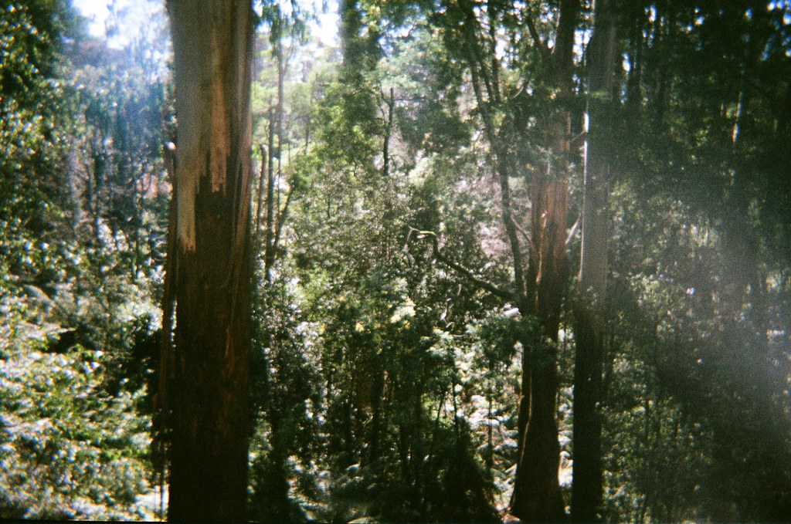

摄影师：Matthew Paul Argall · [原图](https://www.flickr.com/photos/79157069@N03/44799930871) · [CC BY 2.0](https://creativecommons.org/licenses/by/2.0/)。这是一张具体曝光与扫描条件下的实拍参考，不是该胶片的统一色彩标准。

### 08 — Wijmersweg vroeg in de morgen op een winterse dag

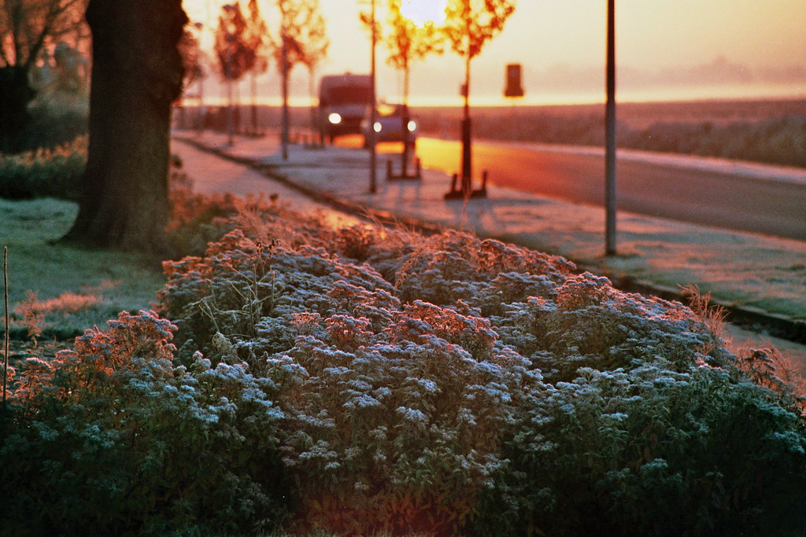

摄影师：m66roepers · [原图](https://www.flickr.com/photos/56603673@N03/32894656316) · [CC BY 2.0](https://creativecommons.org/licenses/by/2.0/)。这是一张具体曝光与扫描条件下的实拍参考，不是该胶片的统一色彩标准。

### 09 — neon light

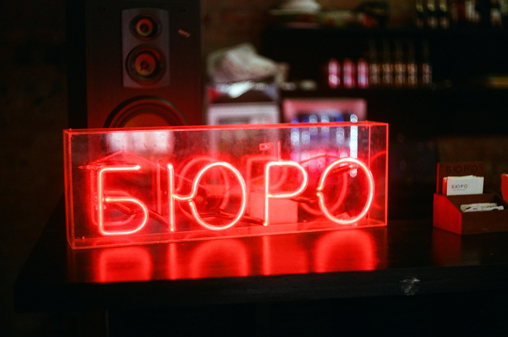

摄影师：electrees · [原图](https://www.flickr.com/photos/107205103@N02/31167123626) · [CC BY 2.0](https://creativecommons.org/licenses/by/2.0/)。这是一张具体曝光与扫描条件下的实拍参考，不是该胶片的统一色彩标准。

### 10 — Vorst en mist

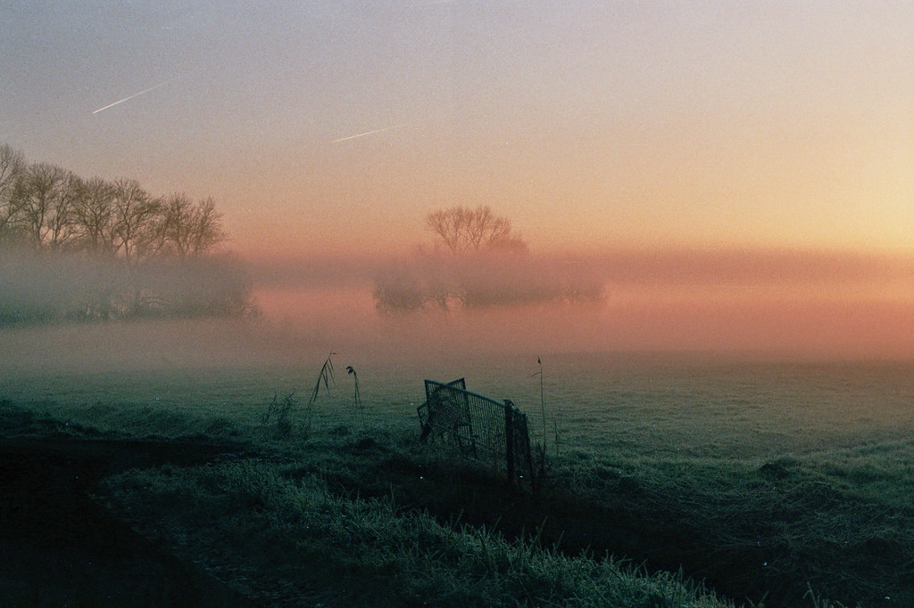

摄影师：m66roepers · [原图](https://www.flickr.com/photos/56603673@N03/32956726725) · [CC BY 2.0](https://creativecommons.org/licenses/by/2.0/)。这是一张具体曝光与扫描条件下的实拍参考，不是该胶片的统一色彩标准。

### 11 — street art museum

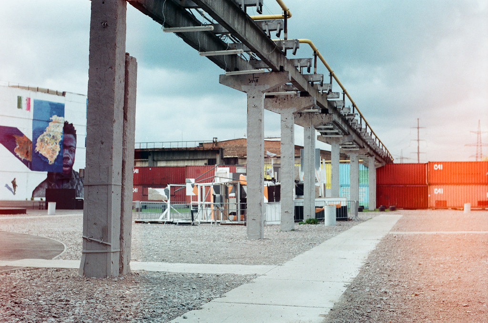

摄影师：electrees · [原图](https://www.flickr.com/photos/107205103@N02/31257861055) · [CC BY 2.0](https://creativecommons.org/licenses/by/2.0/)。这是一张具体曝光与扫描条件下的实拍参考，不是该胶片的统一色彩标准。
